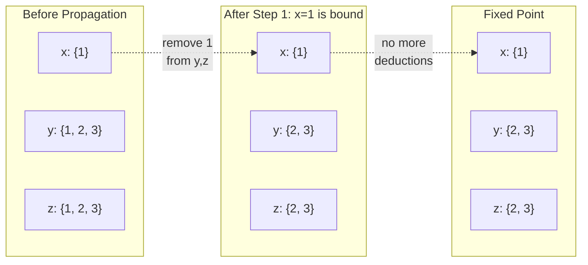
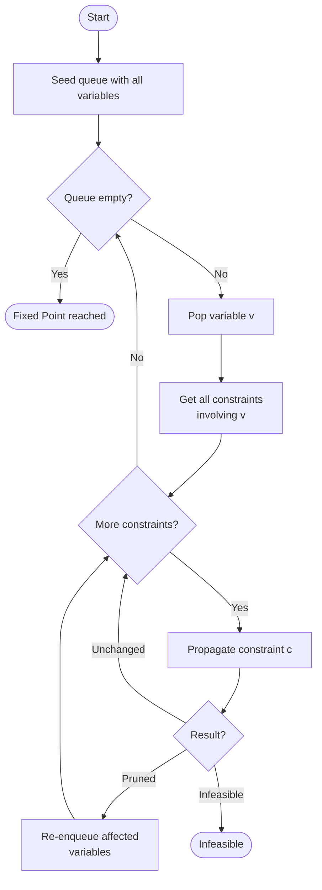
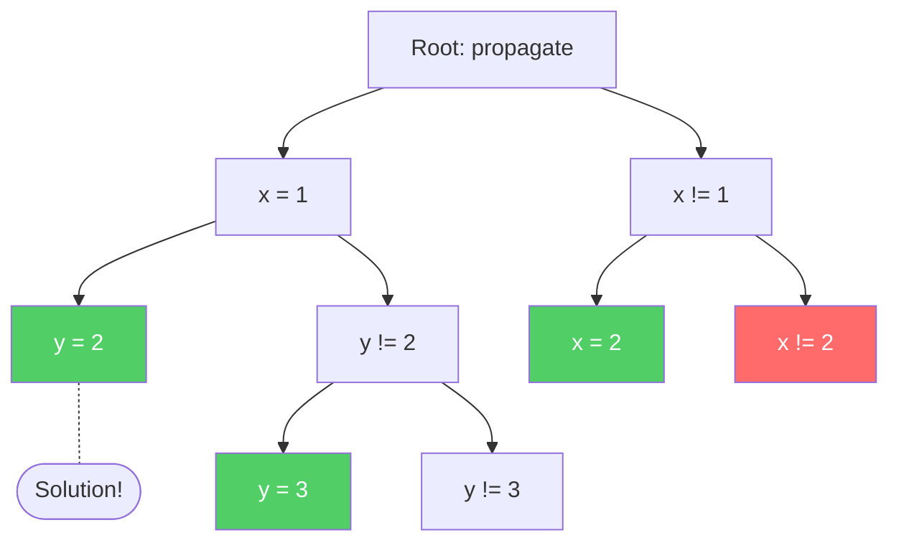
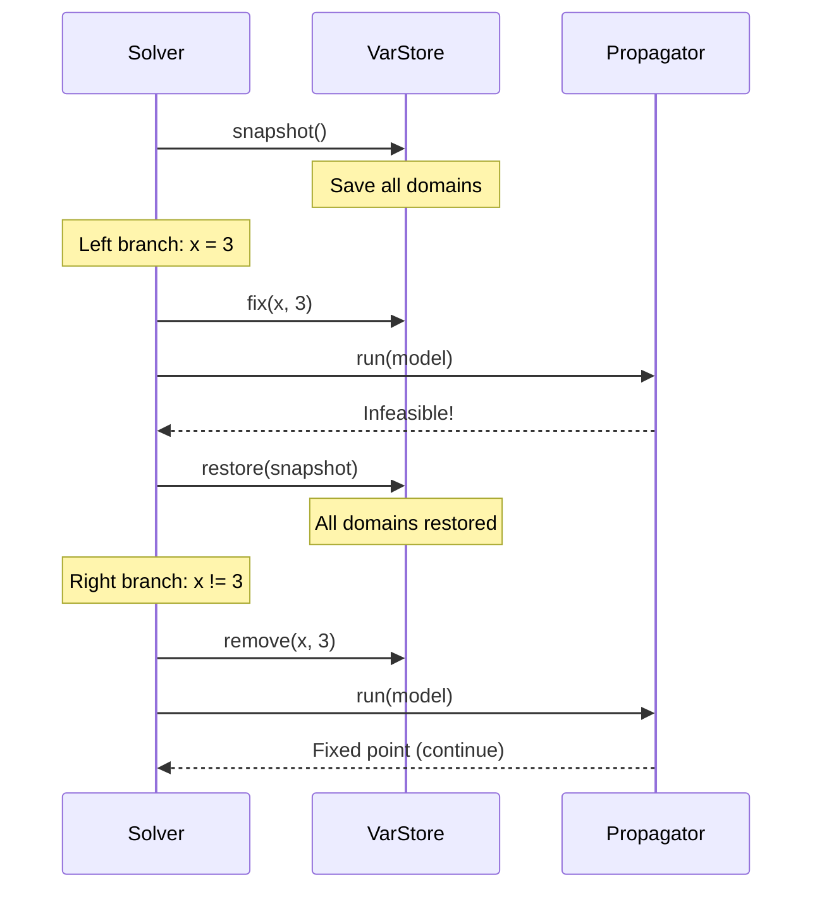
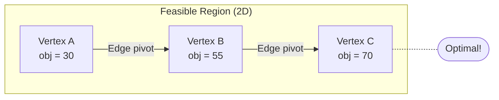
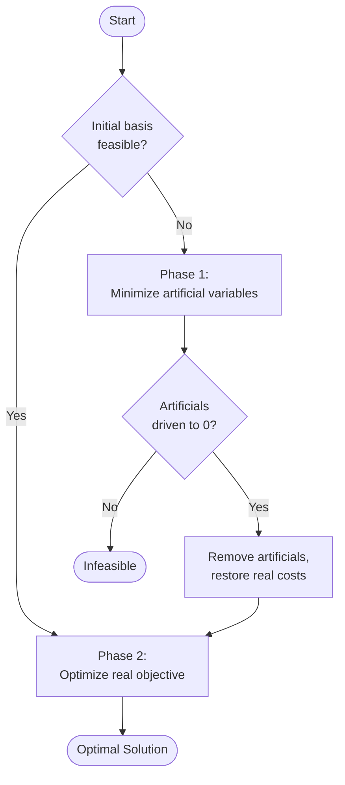
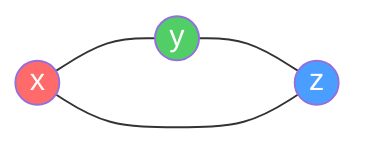
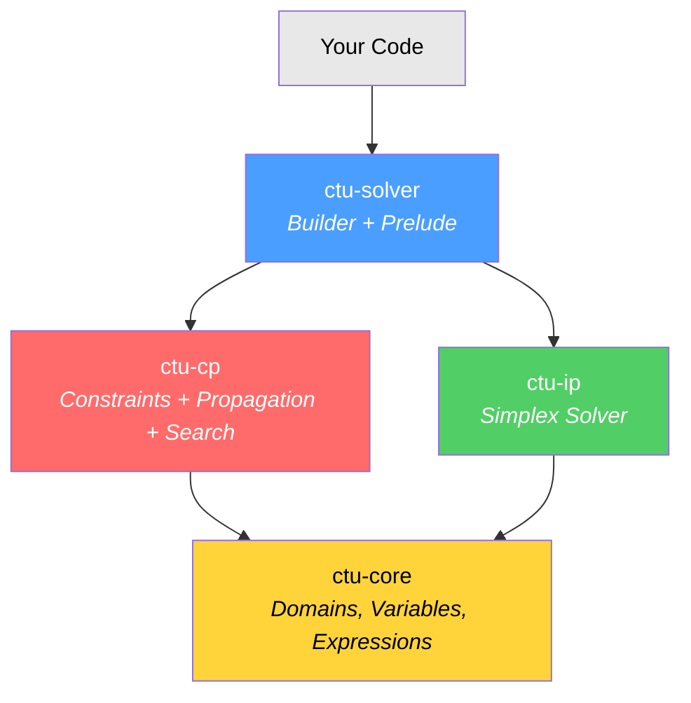
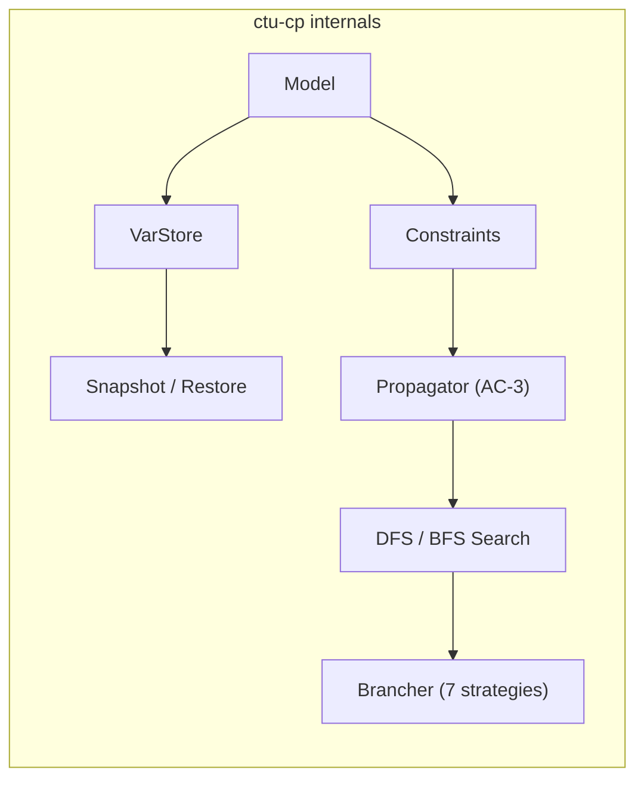

# Building a Constraint Solver in Rust: The Math Behind CTU-Solver

How do you tell a computer to solve a Sudoku, schedule a university timetable, or find the optimal route for a delivery truck? You don't write an algorithm for each problem. You **describe** the problem and let a solver figure it out.

CTU-Solver is a Rust library that does exactly this. It combines two families of mathematical techniques --- **Constraint Programming (CP)** and **Integer Programming (IP)** --- into one unified API. This post walks through the mathematical foundations, how they're implemented in Rust, and how to use the final library.

---

## The Two Pillars

### Constraint Programming: Search + Inference

Constraint programming models a problem as:

- A set of **variables**, each with a **domain** of possible values
- A set of **constraints** restricting which combinations of values are allowed

The solver finds an assignment of values to all variables that satisfies every constraint simultaneously.

Mathematically, a **Constraint Satisfaction Problem (CSP)** is a triple *(X, D, C)* where:

- *X = {x_1, x_2, ..., x_n}* is a set of variables
- *D = {D_1, D_2, ..., D_n}* is a set of domains, where *D_i* is the finite set of values *x_i* can take
- *C = {c_1, c_2, ..., c_m}* is a set of constraints, where each *c_j* is a relation over a subset of *X*

A **solution** is a mapping *x_i -> v_i* for all *i*, where *v_i in D_i* and every constraint is satisfied.


*The N-Queens problem is a classic CSP: place N queens on an NxN board so no two attack each other. Each row is a variable, the column is its domain value, and the constraints enforce no shared column, row, or diagonal.*

### Integer Programming: Optimization over Polyhedra

Integer Programming attacks a different (but related) class of problems. Instead of "find any valid assignment," it asks "find the **best** valid assignment" where "best" is measured by a linear objective function, and constraints are linear inequalities:

```
maximize   c^T x
subject to Ax <= b
           0 <= x <= ub
           x in Z^n  (integer)
```

The **LP relaxation** (drop the integrality requirement) gives a bound on the optimal value and can be solved efficiently by the simplex method.

CTU-Solver provides both approaches under one roof.

---

## Constraint Programming: How It Works

The CP solver has three core components that work together: **domains**, **propagation**, and **search**.

### Domains: What Values Can a Variable Take?

Each variable owns a domain --- the set of values still considered possible. As the solver works, domains only shrink; they never grow (monotonicity).

CTU-Solver supports three domain representations:

| Representation | Mathematical Object | Example | Use Case |
|---------------|---------------------|---------|----------|
| Discrete | Finite set *D subset Z* | {1, 3, 5, 7} | Integer variables (most common) |
| Interval | Closed interval *[l, u] subset R* | [0.0, 100.0] | Continuous/real variables |
| Interval Union | Union of disjoint intervals | [0, 2] union [5, 8] | After removing interior values |

All three share a uniform interface for pruning operations --- `remove_int`, `remove_lt`, `remove_gt`, `fix_to`, etc. Each returns a `DomainDelta` indicating whether the domain was `Unchanged`, `Pruned`, or `Emptied`:

```rust
pub enum DomainDelta {
    Pruned,    // Domain was modified but remains non-empty
    Unchanged, // No change
    Emptied,   // Domain became empty — infeasible!
}
```

When the domain shrinks to a single value, the variable is **bound** (assigned). When the domain becomes empty, the current state is **infeasible** --- we've proven no solution exists in this branch.

### Constraint Propagation: The AC-3 Algorithm

The real power of CP comes from **propagation** --- using constraints to deduce that certain values are impossible, and removing them from domains *before* making any guesses.

#### A Step-by-Step Example

Consider `AllDifferent(x, y, z)` with initial domains:



Since `x` is bound to 1, propagation removes 1 from the domains of `y` and `z`. No further deductions can be made --- we've reached a **fixed point**.

The solver repeats this process --- propagate, check, propagate again --- until no constraint can remove any more values. This is the **AC-3 (Arc Consistency 3)** algorithm:



**Why does it terminate?** Each propagation step strictly removes values from some domain. Domains are finite and can only shrink. So after a bounded number of steps, no more progress can be made. The complexity is O(e * d^3) where *e* is the number of constraints and *d* is the max domain size.

The implementation uses a `VecDeque` for FIFO ordering and a `HashSet` for O(1) membership checks, preventing redundant re-processing of the same variable:

```rust
pub struct Propagator {
    queue: VecDeque<VarId>,
    in_queue: HashSet<VarId>,
}
```

#### Inside AllDifferent Propagation

The `AllDifferent` constraint is the workhorse of CP. Its propagation rule is simple but powerful: if any variable is bound to value *v*, remove *v* from every other variable's domain.

Here's the actual implementation from the codebase:

```rust
fn propagate(&self, store: &mut VarStore) -> PropagateResult {
    // Step 1: collect all bound variables and their values
    let mut bound_vals: Vec<(VarId, Int)> = Vec::new();
    for &vid in &self.var_ids {
        if let Some(var) = store.get(vid) {
            if var.is_bound() {
                if let Some(val) = var.eval_as_real() {
                    bound_vals.push((vid, val.round() as Int));
                }
            }
        }
    }

    let mut result: PropagateResult = PropagateResult::Unchanged;
    // Step 2: remove each bound value from all other variables
    for &(bound_id, val) in &bound_vals {
        for &vid in &self.var_ids {
            if vid == bound_id { continue; }
            let delta: DomainDelta = match store.domain_mut(vid) {
                Some(d) => d.remove_int(val),
                None => continue,
            };
            match delta {
                DomainDelta::Emptied => return PropagateResult::Infeasible(vid),
                DomainDelta::Pruned => {
                    result = merge_propagate(result, PropagateResult::Pruned);
                }
                DomainDelta::Unchanged => {}
            }
        }
    }
    result
}
```

Notice how `DomainDelta::Emptied` causes an immediate return --- as soon as any domain becomes empty, we know this branch is dead. This early detection is what makes propagation powerful.

### The Constraint Trait

Every constraint in CTU-Solver implements the same trait, making the system extensible:

```rust
pub trait Constraint: fmt::Debug + fmt::Display {
    fn id(&self) -> ConstrId;
    fn vars(&self) -> Vec<VarId>;
    fn is_feasible(&self, store: &VarStore) -> bool;
    fn propagate(&self, store: &mut VarStore) -> PropagateResult;
    fn negation(&self) -> Box<dyn Constraint>;
    fn eval(&self, store: &VarStore) -> Real;
}
```

The three key methods:
- **`propagate`** --- the brain: removes infeasible values from domains
- **`is_feasible`** --- quick check: can the constraint still be satisfied?
- **`negation`** --- returns the logical opposite (needed for binary branching: if `x == v` fails, try `x != v`)

This design means adding a new constraint type is just implementing this trait --- the solver, propagation engine, and search tree work unchanged.

### Search: Systematic Exploration via Backtracking

Propagation alone can't solve most problems --- it only eliminates obviously impossible values. When propagation reaches a fixed point but variables remain unbound, the solver must **guess**.

The search strategy is **binary branching**. Pick an unbound variable *x* and a value *v* from its domain. Create two sub-problems:

1. **Left branch:** *x = v* (fix the variable to this value)
2. **Right branch:** *x != v* (exclude this value)

Each branch triggers propagation, which may either solve the problem, detect infeasibility, or require further branching.


*The 8-Queens problem illustrates backtracking search: the solver places queens row by row, backtracking when a conflict is found. CTU-Solver uses the same backtracking principle with binary branching.*

This builds a binary **search tree**:



The solver uses **DFS (Depth-First Search)** with a stack for the default strategy, which finds the first feasible solution and returns immediately. A **BFS (Best-First Search)** mode with branch-and-bound is also available for optimization problems.


*DFS explores the leftmost branch fully before backtracking --- exactly how the solver explores the search tree.*

**Backtracking** is implemented via **snapshot/restore** of domains. Before branching, all variable domains are saved. If a branch fails, domains are restored to the saved state:



The snapshot only saves domain data (a `Vec<Domain>`), not the entire model. This keeps memory overhead minimal while allowing arbitrary-depth backtracking.

### Variable Selection: Which Variable to Branch On?

The choice of which variable to branch on dramatically affects performance. The classic heuristic is **fail-first**: pick the variable with the smallest domain, so contradictions are discovered sooner.

CTU-Solver provides seven strategies:

| Strategy | Intuition |
|----------|-----------|
| First Unbound | Simple, predictable order |
| **Min Domain** (default) | Fail-first: smallest domain = soonest contradiction |
| Max Domain | Explore widely first |
| Least Min Bound | Prefer smallest values |
| Greatest Min Bound | Prefer largest lower bounds |
| Least Max Bound | Tightest upper bounds |
| Greatest Max Bound | Widest upper bounds |

In practice, **Min Domain** (fail-first) dominates. The intuition: a variable with domain {1, 2} will produce at most 2 branches, while one with domain {1, 2, ..., 100} produces up to 100. Branching on smaller domains keeps the tree shallow.

### Solver Statistics

The solver tracks useful metrics during search:

```rust
pub struct SolverStats {
    pub fails: usize,          // Number of dead-end branches
    pub choice_points: usize,  // Total branching nodes created
    pub solutions_found: usize,// Feasible solutions discovered
    pub nodes_treated: usize,  // Total nodes visited
    pub elapsed: Duration,     // Wall-clock time
}
```

These statistics help diagnose performance issues --- a high fail count suggests the branching strategy or constraint model could be improved.

---

## Integer Programming: The Simplex Method

While CP excels at discrete combinatorial problems, some problems are naturally expressed as linear optimization. CTU-Solver includes a **bounded-variable two-phase revised simplex** solver.

### The Geometry

A linear program defines a **polyhedron** in n-dimensional space (the intersection of half-spaces defined by `Ax <= b` and `0 <= x <= ub`). The simplex method walks along **vertices** (extreme points) of this polyhedron, always improving the objective, until it reaches the optimum.


*The feasible region of a linear program is a convex polytope. The simplex method moves from vertex to vertex along edges, always improving the objective value.*



Each vertex corresponds to a **basis** --- a set of *m* variables (out of *n* total) that are "active" (basic). Non-basic variables sit at their lower bound (0) or upper bound.

### Two-Phase Method

When the initial basis isn't feasible (some `b_i < 0`), Phase 1 introduces **artificial variables** and minimizes their sum to zero. If it succeeds, we have a feasible basis and Phase 2 optimizes the real objective:



### Eta Factorization: Efficient Basis Updates

Each simplex iteration requires computing `B^(-1) * column` (forward solve) and `row * B^(-1)` (backward solve), where *B* is the *m x m* basis matrix. Inverting *B* from scratch each iteration would be O(m^3) --- far too expensive.

Instead, the solver uses **eta factorization** (product-form inverse). Each pivot is recorded as an elementary matrix *E_k*. The basis inverse becomes:

```
B^(-1) = E_k^(-1) * E_(k-1)^(-1) * ... * E_1^(-1)
```

Applying each *E_k^(-1)* costs O(m), so a forward/backward solve costs O(k * m) where *k* is the number of pivots since the last refactorization.

Here's the actual `EtaFile` structure and its forward solve:

```rust
pub struct EtaFile {
    pivot_rows: Vec<usize>,       // Which row was pivoted at each step
    eta_cols: Vec<Vec<Real>>,     // The eta column for each pivot
}

impl EtaFile {
    /// Forward solve: compute B^(-1) * col, modifying col in place.
    pub fn forward_solve(&self, col: &mut [Real]) {
        let n: usize = self.pivot_rows.len();
        // invariant col has been transformed by eta[0..k]
        for k in 0..n {
            let pivot: usize = self.pivot_rows[k];
            let eta_col: &[Real] = &self.eta_cols[k];
            col[pivot] /= eta_col[pivot];
            let val: Real = col[pivot];
            // Eliminate: subtract pivot contribution from all other rows
            for i in 0..col.len() {
                if i != pivot {
                    col[i] -= val * eta_col[i];
                }
            }
        }
    }
}
```

The backward solve applies the same eta matrices in reverse order (newest to oldest), computing `row * B^(-1)` for pricing out reduced costs.

### Bounded Variables and Pivot Types

Classical simplex assumes `x >= 0`. With upper bounds `x <= ub`, three things can happen during a pivot:

| Event | What Happens |
|-------|-------------|
| **Standard pivot** | Entering variable enters basis; leaving variable goes to its lower bound (0) |
| **Upper pivot** | Entering variable enters basis; leaving variable hits its upper bound |
| **Bound flip** | Entering variable hits its own upper bound; no basis change at all |

Bound flips are particularly efficient --- no eta matrix update needed, just flip the variable's status and update the objective.

### Numerical Stability

Floating-point arithmetic is treacherous. The solver uses epsilon-aware comparisons throughout:

```rust
pub const EPSILON: Real = 1e-6;

pub mod fp {
    pub fn eq(a: Real, b: Real) -> bool  { (a - b).abs() < EPSILON }
    pub fn lower(a: Real, b: Real) -> bool { a < b - EPSILON }
}
```

The simplex solver also defines domain-specific constants: `EPS = 1e-8` for pivot tolerance, `BIG = 1e30` for effectively infinite bounds, and `BIG_THETA = 1e20` for ratio test initialization.

---

## Rust Design Patterns

The codebase uses several interesting Rust patterns worth highlighting.

### Type Erasure via Enum

The `Var` trait provides a uniform interface for `IntVar`, `BoolVar`, and `RealVar`. But `Var: Clone` means it isn't object-safe (can't use `dyn Var`). The solution: **type erasure via enum**:

```rust
pub enum AnyVar {
    Int(IntVar),
    Bool(BoolVar),
    Real(RealVar),
}
```

`AnyVar` delegates `Var` methods to the inner type. This avoids boxing, preserves `Clone`, and keeps everything on the stack.

### Strongly-Typed IDs

Variables, constraints, and search nodes each get a **newtype ID** backed by `AtomicU64` for thread-safe generation:

```rust
#[derive(Debug, Clone, Copy, PartialEq, Eq, Hash)]
pub struct VarId(u64);

pub fn next_var_id() -> VarId {
    static COUNTER: AtomicU64 = AtomicU64::new(0);
    VarId(COUNTER.fetch_add(1, Ordering::Relaxed))
}
```

You can't accidentally use a `VarId` where a `ConstrId` is expected --- the type system catches it at compile time. No runtime overhead compared to raw `u64`.

### Split Borrow Pattern

The solver needs to iterate over constraints while mutating the variable store. Rust's borrow checker forbids `&constraints` and `&mut store` if both live inside `Model`. The solution: a method that returns both simultaneously:

```rust
impl Model {
    pub fn constraints_and_store_mut(
        &mut self,
    ) -> (&[Box<dyn Constraint>], &mut VarStore) {
        (&self.constraints, &mut self.store)
    }
}
```

This explicitly splits the borrow, telling the compiler the two references don't alias. No `unsafe`, no `RefCell` --- pure safe Rust.

### Snapshot/Restore Without Clone

Backtracking requires saving and restoring state. Rather than cloning the entire model (expensive), only the domain data is saved:

```rust
pub struct VarStoreSnapshot {
    domains: Vec<Domain>,  // Just the domains, nothing else
}
```

This is both faster and uses less memory than a full model clone, since constraints, linkage tables, and variable metadata don't change during search.

---

## The Constraint Catalog

CTU-Solver ships with **33+ constraint types** organized into 7 families. Here's the full catalog:

### Comparison Constraints (Linear Expressions)

These compare two `LinearExpr` objects (e.g., `2x + 3y` vs `z + 5`):

| Constraint | Semantics |
|-----------|-----------|
| `EqualConstr` | `lhs == rhs` |
| `DifferentConstr` | `lhs != rhs` |
| `LessConstr` | `lhs < rhs` |
| `LessOrEqualConstr` | `lhs <= rhs` |
| `GreaterConstr` | `lhs > rhs` |
| `GreaterOrEqualConstr` | `lhs >= rhs` |

### Variable-Value Constraints

Quick constraints comparing a single variable to a constant:

| Constraint | Semantics |
|-----------|-----------|
| `EqualVarValConstr` | `x == c` |
| `DifferentVarValConstr` | `x != c` |
| `LessVarValConstr` | `x < c` |
| `LessOrEqualVarValConstr` | `x <= c` |
| `GreaterVarValConstr` | `x > c` |
| `GreaterOrEqualVarValConstr` | `x >= c` |

### Set Constraints

| Constraint | Semantics |
|-----------|-----------|
| `AllDifferentConstr` | All variables take distinct values |
| `AtLeastTwoEqualConstr` | At least two variables share a value (negation of AllDifferent) |
| `InSetConstr` | Variable must be in a given set |
| `NotInSetConstr` | Variable must not be in a given set |

### Logic Constraints

| Constraint | Semantics |
|-----------|-----------|
| `AndConstr` | All sub-constraints must hold |
| `OrConstr` | At least one sub-constraint must hold |
| `IfThenConstr` | `if P then Q` (implication) |
| `IfThenElseConstr` | `if P then Q else R` |
| `IfThenLogicConstr` | Logical implication with reification |
| `EmptyConstr` | Always true (no-op) |

### Interval Constraints

| Constraint | Semantics |
|-----------|-----------|
| `InClosedIntervalConstr` | `lb <= x <= ub` |
| `InClosedIntervalsConstr` | `x` in union of intervals |
| `NotInIntervalsConstr` | `x` not in any of the given intervals |

### Indexed Constraints

For element/lookup constraints (array access with variable index):

| Constraint | Semantics |
|-----------|-----------|
| `IndexedArrayConstr` | `result == array[index]` (integer array) |
| `Indexed2DArrayConstr` | `result == matrix[i][j]` |
| `IndexedRealArrayConstr` | `result == array[index]` (real array) |
| `IndexedReal2DArrayConstr` | `result == matrix[i][j]` (real) |

### Matrix Constraints

For structured grid problems:

| Constraint | Semantics |
|-----------|-----------|
| `RowsPermutationsConstr` | Each row is a permutation of the same set |
| `ColsNotAscentsConstr` | No ascending sequences in columns |

---

## Putting It All Together: The API

### Quick Start

Everything is accessible through a single prelude import:

```rust
use ctu_solver::prelude::*;
```

The workflow is always: **create model -> add variables -> add constraints -> solve -> read solution**.

### Example: Map Coloring

Color three mutually adjacent regions with three colors:



```rust
use ctu_solver::prelude::*;

let mut model: Model = Model::new("map_coloring");

// Three regions, each can be color 0, 1, or 2
let x: VarId = model.int_var("x", 0, 2);
let y: VarId = model.int_var("y", 0, 2);
let z: VarId = model.int_var("z", 0, 2);

// All adjacent regions must have different colors
model.add_constraint(Box::new(AllDifferentConstr::new(vec![x, y, z])));

// Solve
let result: SolveResult = SolverBuilder::new(&mut model).solve();

// Extract solution
let sol: &Solution = result.solution().unwrap();
println!("x={}, y={}, z={}", sol.value(x), sol.value(y), sol.value(z));
```

### Example: SEND + MORE = MONEY

The classic cryptarithmetic puzzle. Each letter is a distinct digit 0-9, and the arithmetic must hold:

```
  S E N D
+ M O R E
---------
M O N E Y
```

The trick is encoding the place-value arithmetic as a single linear equation:

```
1000*S + 100*E + 10*N + D + 1000*M + 100*O + 10*R + E
  = 10000*M + 1000*O + 100*N + 10*E + Y
```

Rearranging: `1000S + 91E - 90N + D - 9000M - 900O + 10R - Y = 0`

```rust
use ctu_solver::prelude::*;

let mut model: Model = Model::new("send_more_money");

let s: VarId = model.int_var("S", 0, 9);
let e: VarId = model.int_var("E", 0, 9);
let n: VarId = model.int_var("N", 0, 9);
let d: VarId = model.int_var("D", 0, 9);
let m: VarId = model.int_var("M", 0, 9);
let o: VarId = model.int_var("O", 0, 9);
let r: VarId = model.int_var("R", 0, 9);
let y: VarId = model.int_var("Y", 0, 9);

// All digits different
model.add_constraint(Box::new(AllDifferentConstr::new(
    vec![s, e, n, d, m, o, r, y],
)));

// Leading digits can't be zero
model.add_constraint(Box::new(GreaterOrEqualVarValConstr::new(s, 1.0)));
model.add_constraint(Box::new(GreaterOrEqualVarValConstr::new(m, 1.0)));

// SEND + MORE = MONEY as a linear equation
let mut lhs: LinearExpr = LinearExpr::zero();
lhs.add_term(s, 1000.0);
lhs.add_term(e, 91.0);
lhs.add_term(n, -90.0);
lhs.add_term(d, 1.0);
lhs.add_term(m, -9000.0);
lhs.add_term(o, -900.0);
lhs.add_term(r, 10.0);
lhs.add_term(y, -1.0);
model.add_constraint(Box::new(EqualConstr::new(lhs, LinearExpr::zero())));

let result: SolveResult = SolverBuilder::new(&mut model)
    .branching(BranchStrategyKind::MinDomainMinVal)
    .solve();

let sol: &Solution = result.solution().unwrap();
// Solution: 9567 + 1085 = 10652
```

### Example: Sudoku with VarMatrix


*A classic Sudoku puzzle --- 81 variables, each with domain {1..9}, constrained by row, column, and 3x3 box AllDifferent constraints.*

For grid problems, `VarMatrix` provides a structured variable layout with convenience methods:

```rust
use ctu_solver::prelude::*;

let mut model: Model = Model::new("sudoku");
let grid: VarMatrix = VarMatrix::new(&mut model, 9, 9, 1, 9, "cell");

// Each row: all different
for i in 0..9 { grid.row_all_different(&mut model, i); }

// Each column: all different
for j in 0..9 { grid.col_all_different(&mut model, j); }

// Each 3x3 box: all different
for br in 0..3 {
    for bc in 0..3 {
        let mut box_vars: Vec<VarId> = Vec::new();
        for r in 0..3 {
            for c in 0..3 {
                box_vars.push(grid.get(br * 3 + r, bc * 3 + c));
            }
        }
        model.add_constraint(Box::new(AllDifferentConstr::new(box_vars)));
    }
}

// Fix known clues
model.add_constraint(Box::new(EqualVarValConstr::new(grid.get(0, 0), 5.0)));
// ... more clues ...

let result: SolveResult = SolverBuilder::new(&mut model).solve();
```

That's it --- 81 variables, 27 AllDifferent constraints (9 rows + 9 columns + 9 boxes), plus clue constraints. The solver handles the rest.

### Example: Linear Programming

For continuous optimization, use the IP subsystem directly:

```rust
use ctu_solver::{LpProblem, Simplex};

// maximize 6x + 8y
// subject to: x + y <= 10, 2x + 3y <= 25, x + 5y <= 35
let mut lp: LpProblem = LpProblem::new(2);
lp.set_objective(vec![6.0, 8.0]);
lp.add_le_constraint(vec![1.0, 1.0], 10.0);
lp.add_le_constraint(vec![2.0, 3.0], 25.0);
lp.add_le_constraint(vec![1.0, 5.0], 35.0);

let mut solver: Simplex = Simplex::new(&lp);
let sol = solver.solve();
assert!(sol.is_optimal());
```

### Configuring the Solver

The builder API lets you tune search behavior:

```rust
use std::time::Duration;

let result: SolveResult = SolverBuilder::new(&mut model)
    .branching(BranchStrategyKind::MinDomainMinVal)  // fail-first heuristic
    .search(SearchStrategy::DepthFirst)               // or BestFirst
    .max_time(Duration::from_secs(60))                 // time limit
    .max_fails(10_000)                                 // backtrack limit
    .solve();

match result {
    SolveResult::Feasible(sol) => { /* use sol.value(x) */ }
    SolveResult::Optimal(sol) => { /* proven optimal */ }
    SolveResult::Infeasible(_) => { /* no solution exists */ }
    SolveResult::TimedOut(maybe_sol, _) => { /* partial result */ }
    SolveResult::MaxFails(maybe_sol, _) => { /* partial result */ }
}
```

The `SolveResult` enum forces you to handle every outcome --- a timeout or fail limit can still carry a partial solution (`maybe_sol`), which is useful for anytime algorithms.

---

## Architecture at a Glance



| Crate | Lines | What It Does |
|-------|-------|-------------|
| **ctu-core** | ~1,800 | Domains, variables, linear expressions, strongly-typed IDs, epsilon numerics |
| **ctu-cp** | ~6,500 | Model, 33+ constraints, AC-3 propagation, DFS/BFS search with branch-and-bound |
| **ctu-ip** | ~900 | Two-phase bounded-variable simplex with eta factorization |
| **ctu-solver** | ~1,500 | Fluent builder API, unified solution types, prelude re-exports |



---

## Key Mathematical Ideas, Summarized

**Constraint Satisfaction** is NP-complete in general, but two techniques make it practical:

1. **Propagation** (polynomial time) eliminates provably impossible values, shrinking the search space exponentially. AC-3 achieves arc consistency in O(e * d^3) where *e* is the number of constraints and *d* is the max domain size.

2. **Branching heuristics** (fail-first) guide the search toward contradictions early, pruning large subtrees before they're explored.

**The Simplex Method** solves LP relaxations in practice-polynomial time (despite worst-case exponential). The key insight: the optimum of a linear function over a polyhedron always occurs at a vertex, and there are finitely many vertices to check.

**Eta factorization** keeps basis updates cheap: O(m) per pivot instead of O(m^3) for a full inverse. The product form degrades over many pivots; periodic refactorization restores numerical stability.

**These techniques compose.** In a branch-and-bound optimization setting, the LP relaxation provides bounds that prune the CP search tree, and CP propagation provides tighter domains that strengthen the LP relaxation. Having both solvers in one library makes this integration natural.

---

## Running the Benchmarks

```bash
cd rust
cargo bench                    # all benchmarks
cargo bench -- n_queens        # specific problem
```

The suite covers seven classic problems, measured with [Criterion.rs](https://github.com/bheisler/criterion.rs) for statistically rigorous timing:

| Problem | Variables | Description |
|---------|-----------|-------------|
| Map Coloring | 6 | Graph coloring with mutual adjacency |
| N-Queens (8) | 8 | Classic backtracking benchmark |
| N-Queens (12) | 12 | Harder variant |
| SEND+MORE=MONEY | 8 | Cryptarithmetic with linear equation |
| Sudoku | 81 | 9x9 grid with AllDifferent |
| Magic Square (3x3) | 9 | Scalar product constraints |
| Coin Change | 4 | Minimal variable count, tight constraints |

---

## Conclusion

CTU-Solver demonstrates that a constraint solver doesn't need to be a monolithic black box. By decomposing the problem into clean abstractions --- domains, constraints (a trait), propagation (AC-3), and search (DFS/BFS with snapshot/restore) --- each piece becomes testable, understandable, and extensible.

The key mathematical insights are simple:
- **Propagation** trades polynomial-time inference for exponential search reduction
- **Binary branching** with **fail-first** heuristics keeps the search tree shallow
- **Eta factorization** makes simplex pivots cheap
- **Bounded-variable simplex** handles real-world LP constraints naturally

And the key engineering insight: Rust's type system (strongly-typed IDs, enum-based type erasure, split borrows) enforces correctness at compile time that other languages check at runtime --- or don't check at all.

The full source is organized as a Cargo workspace with 4 crates, ~10,500 lines of solver code, and comprehensive tests from map coloring to Sudoku. Add a dependency, import the prelude, and start describing problems.
