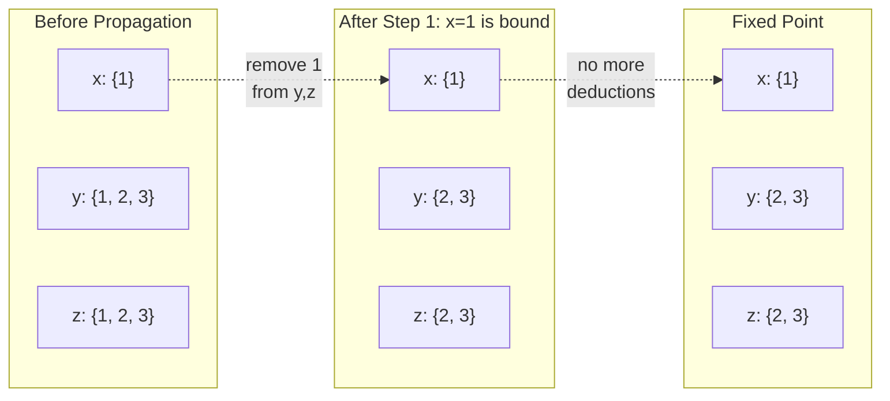
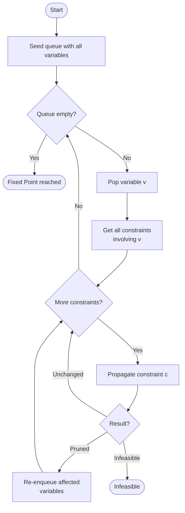
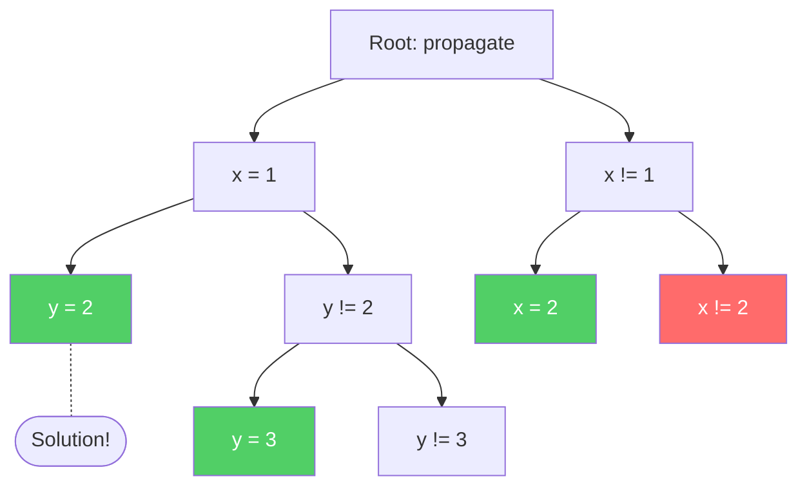
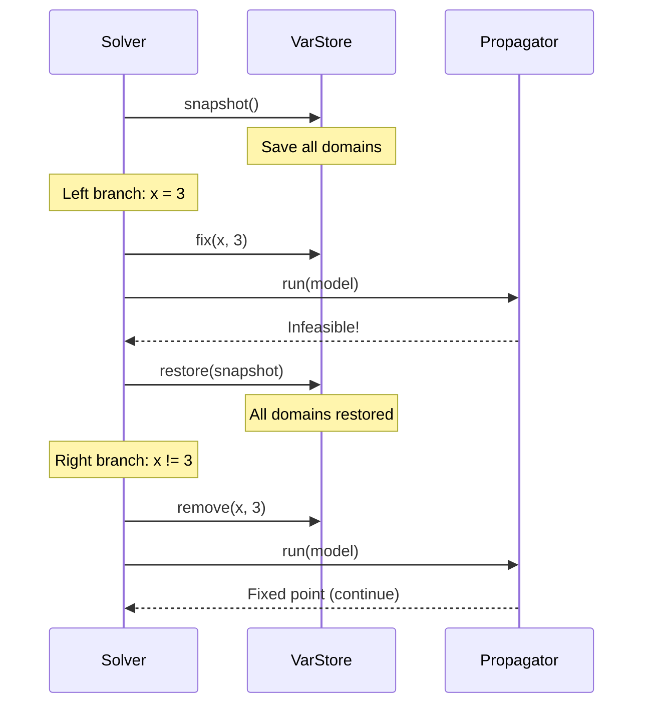
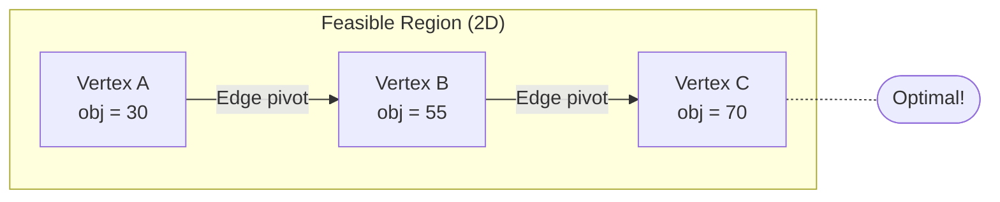
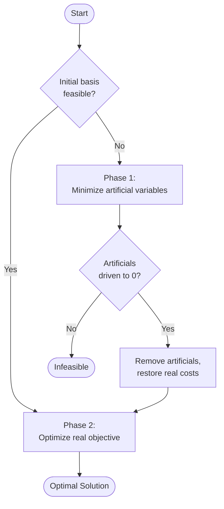
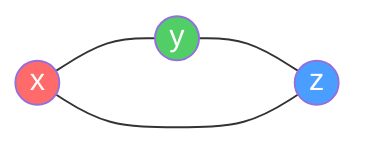
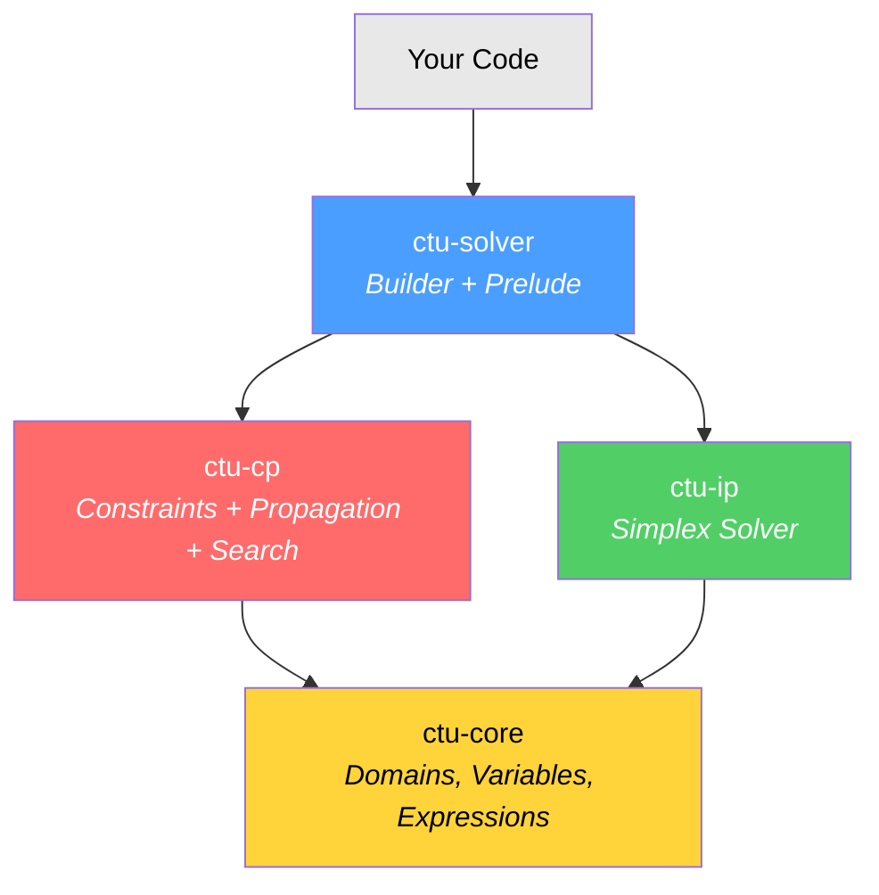
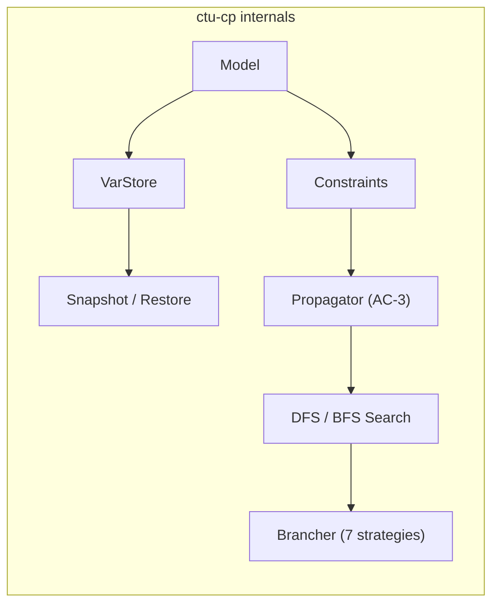

# Construire un Solver de Contraintes en Rust : Les Mathématiques derrière CTU-Solver

Comment ordonne-t-on à un ordinateur de résoudre un Sudoku, d'établir l'horaire d'une université ou de trouver la route optimale pour un camion de livraison ? On n'écrit pas un algorithme pour chaque problème. On **décrit** le problème et on laisse un solver le résoudre.

CTU-Solver est une bibliothèque Rust qui fait exactement cela. Elle combine deux familles de techniques mathématiques --- la **Programmation par Contraintes (CP)** et la **Programmation Entière (IP)** --- en une seule API unifiée. Cet article vous explique les fondements mathématiques, comment ils sont implémentés en Rust, et comment utiliser la bibliothèque finale.

---

## Les Deux Piliers

### Programmation par Contraintes : Recherche + Inférence

La programmation par contraintes modélise un problème comme :

- Un ensemble de **variables**, chacune avec un **domaine** de valeurs possibles
- Un ensemble de **contraintes** restreignant quelles combinaisons de valeurs sont autorisées

Le solver trouve une assignation de valeurs à toutes les variables qui satisfait chaque contrainte simultanément.

Mathématiquement, un **Problème de Satisfaction de Contraintes (CSP)** est un triple *(X, D, C)* où :

- *X = {x_1, x_2, ..., x_n}* est un ensemble de variables
- *D = {D_1, D_2, ..., D_n}* est un ensemble de domaines, où *D_i* est l'ensemble fini des valeurs que *x_i* peut prendre
- *C = {c_1, c_2, ..., c_m}* est un ensemble de contraintes, où chaque *c_j* est une relation sur un sous-ensemble de *X*

Une **solution** est un mappage *x_i -> v_i* pour tout *i*, où *v_i in D_i* et chaque contrainte est satisfaite.


*Le problème des N reines est un CSP classique : placer N reines sur un plateau NxN de sorte qu'aucune ne s'attaque mutuellement. Chaque ligne est une variable, la colonne est sa valeur de domaine, et les contraintes garantissent pas de colonne, ligne ou diagonale partagée.*

### Programmation Entière : Optimisation sur des Polyèdres

La programmation entière attaque une classe de problèmes différente (mais liée). Au lieu de « trouver une assignation valide quelconque », elle demande « trouver la **meilleure** assignation valide » où « meilleure » est mesurée par une fonction objectif linéaire, et les contraintes sont des inégalités linéaires :

```
maximize   c^T x
subject to Ax <= b
           0 <= x <= ub
           x in Z^n  (integer)
```

La **relaxation LP** (supprimer l'exigence d'intégrité) donne une borne sur la valeur optimale et peut être résolue efficacement par la méthode simplex.

CTU-Solver fournit les deux approches sous un même toit.

---

## Programmation par Contraintes : Comment ça fonctionne

Le solver CP a trois composants clés qui travaillent ensemble : **domaines**, **propagation**, et **recherche**.

### Domaines : Quelles Valeurs une Variable Peut-elle Prendre ?

Chaque variable possède un domaine --- l'ensemble des valeurs toujours considérées comme possibles. Alors que le solver progresse, les domaines ne font que rétrécir ; ils ne grandissent jamais (monotonie).

CTU-Solver supporte trois représentations de domaines :

| Représentation | Objet Mathématique | Exemple | Cas d'usage |
|---------------|---------------------|---------|----------|
| Discret | Ensemble fini *D subset Z* | {1, 3, 5, 7} | Variables entières (le plus courant) |
| Intervalle | Intervalle fermé *[l, u] subset R* | [0.0, 100.0] | Variables continues/réelles |
| Union d'Intervalles | Union d'intervalles disjoints | [0, 2] union [5, 8] | Après suppression de valeurs intérieures |

Les trois partagent une interface uniforme pour les opérations d'élagage --- `remove_int`, `remove_lt`, `remove_gt`, `fix_to`, etc. Chacune retourne une `DomainDelta` indiquant si le domaine était `Unchanged`, `Pruned`, ou `Emptied` :

```rust
pub enum DomainDelta {
    Pruned,    // Domain was modified but remains non-empty
    Unchanged, // No change
    Emptied,   // Domain became empty — infeasible!
}
```

Quand le domaine se réduit à une seule valeur, la variable est **bound** (assignée). Quand le domaine devient vide, l'état actuel est **infaisable** --- on a prouvé qu'aucune solution n'existe dans cette branche.

### Propagation de Contraintes : L'Algorithme AC-3

La vraie puissance de CP vient de la **propagation** --- utiliser les contraintes pour déduire que certaines valeurs sont impossibles, et les enlever des domaines *avant* de faire des suppositions.

#### Un Exemple Étape par Étape

Considérez `AllDifferent(x, y, z)` avec domaines initiaux :



Puisque `x` est bound à 1, la propagation enlève 1 des domaines de `y` et `z`. Aucune déduction supplémentaire ne peut être faite --- on a atteint un **point fixe**.

Le solver répète ce processus --- propagate, check, propagate à nouveau --- jusqu'à ce qu'aucune contrainte ne puisse enlever plus de valeurs. C'est l'algorithme **AC-3 (Arc Consistency 3)** :



**Pourquoi ça termine ?** Chaque étape de propagation enlève strictement des valeurs de certains domaines. Les domaines sont finis et ne peuvent que rétrécir. Donc après un nombre borné d'étapes, aucun progrès supplémentaire ne peut être fait. La complexité est O(e * d^3) où *e* est le nombre de contraintes et *d* est la taille maximale du domaine.

L'implémentation utilise une `VecDeque` pour l'ordre FIFO et une `HashSet` pour les vérifications O(1) d'appartenance, empêchant le retraitement redondant de la même variable :

```rust
pub struct Propagator {
    queue: VecDeque<VarId>,
    in_queue: HashSet<VarId>,
}
```

#### À l'intérieur de la Propagation AllDifferent

La contrainte `AllDifferent` est la bête de somme de CP. Sa règle de propagation est simple mais puissante : si une variable est bound à la valeur *v*, enlever *v* du domaine de chaque autre variable.

Voici l'implémentation réelle du code :

```rust
fn propagate(&self, store: &mut VarStore) -> PropagateResult {
    // Step 1: collect all bound variables and their values
    let mut bound_vals: Vec<(VarId, Int)> = Vec::new();
    for &vid in &self.var_ids {
        if let Some(var) = store.get(vid) {
            if var.is_bound() {
                if let Some(val) = var.eval_as_real() {
                    bound_vals.push((vid, val.round() as Int));
                }
            }
        }
    }

    let mut result: PropagateResult = PropagateResult::Unchanged;
    // Step 2: remove each bound value from all other variables
    for &(bound_id, val) in &bound_vals {
        for &vid in &self.var_ids {
            if vid == bound_id { continue; }
            let delta: DomainDelta = match store.domain_mut(vid) {
                Some(d) => d.remove_int(val),
                None => continue,
            };
            match delta {
                DomainDelta::Emptied => return PropagateResult::Infeasible(vid),
                DomainDelta::Pruned => {
                    result = merge_propagate(result, PropagateResult::Pruned);
                }
                DomainDelta::Unchanged => {}
            }
        }
    }
    result
}
```

Notez comment `DomainDelta::Emptied` provoque un retour immédiat --- dès qu'un domaine devient vide, on sait que cette branche est morte. Cette détection précoce est ce qui rend la propagation puissante.

### Le Trait Constraint

Chaque contrainte dans CTU-Solver implémente le même trait, rendant le système extensible :

```rust
pub trait Constraint: fmt::Debug + fmt::Display {
    fn id(&self) -> ConstrId;
    fn vars(&self) -> Vec<VarId>;
    fn is_feasible(&self, store: &VarStore) -> bool;
    fn propagate(&self, store: &mut VarStore) -> PropagateResult;
    fn negation(&self) -> Box<dyn Constraint>;
    fn eval(&self, store: &VarStore) -> Real;
}
```

Les trois méthodes clés :
- **`propagate`** --- le cerveau : enlève les valeurs non viables des domaines
- **`is_feasible`** --- check rapide : la contrainte peut-elle encore être satisfaite ?
- **`negation`** --- retourne l'opposé logique (nécessaire pour le branchement binaire : si `x == v` échoue, essayer `x != v`)

Ce design signifie que ajouter un nouveau type de contrainte consiste juste à implémenter ce trait --- le solver, le moteur de propagation, et l'arbre de recherche fonctionnent inchangés.

### Recherche : Exploration Systématique via Backtracking

La propagation seule ne peut pas résoudre la plupart des problèmes --- elle ne supprime que les valeurs clairement impossibles. Quand la propagation atteint un point fixe mais que les variables restent non-bound, le solver doit **deviner**.

La stratégie de recherche est le **branchement binaire**. Choisir une variable non-bound *x* et une valeur *v* de son domaine. Créer deux sous-problèmes :

1. **Branche gauche :** *x = v* (fixer la variable à cette valeur)
2. **Branche droite :** *x != v* (exclure cette valeur)

Chaque branche déclenche la propagation, qui peut soit résoudre le problème, détecter l'infaisabilité, ou nécessiter un branchement supplémentaire.


*Le problème des 8 reines illustre la recherche par backtracking : le solver place les reines rangée par rangée, en reculant quand un conflit est trouvé. CTU-Solver utilise le même principe de backtracking avec le branchement binaire.*

Cela construit un **arbre de recherche** binaire :



Le solver utilise **DFS (Depth-First Search)** avec une pile pour la stratégie par défaut, qui trouve la première solution réalisable et retourne immédiatement. Un mode **BFS (Best-First Search)** avec branch-and-bound est aussi disponible pour les problèmes d'optimisation.


*DFS explore complètement la branche la plus à gauche avant de reculer --- exactement comment le solver explore l'arbre de recherche.*

Le **backtracking** est implémenté via **snapshot/restore** des domaines. Avant le branchement, tous les domaines de variables sont sauvegardés. Si une branche échoue, les domaines sont restaurés à l'état sauvegardé :



Le snapshot ne sauvegarde que les données de domaine (une `Vec<Domain>`), pas le modèle entier. Cela garde les frais de mémoire minimaux tout en permettant le backtracking à profondeur arbitraire.

### Sélection de Variable : Quelle Variable Brancher ?

Le choix de quelle variable brancher affecte dramatiquement la performance. L'heuristique classique est **fail-first** : choisir la variable avec le plus petit domaine, pour découvrir les contradictions plus tôt.

CTU-Solver fournit sept stratégies :

| Stratégie | Intuition |
|----------|-----------|
| First Unbound | Ordre simple, prévisible |
| **Min Domain** (défaut) | Fail-first : plus petit domaine = contradiction plus tôt |
| Max Domain | Explorer largement d'abord |
| Least Min Bound | Préférer les plus petites valeurs |
| Greatest Min Bound | Préférer les plus grands minima |
| Least Max Bound | Préférer les plus petits maxima |
| Greatest Max Bound | Préférer les plus larges maxima |

En pratique, **Min Domain** (fail-first) domine. L'intuition : une variable avec domaine {1, 2} produira au plus 2 branches, tandis qu'une avec domaine {1, 2, ..., 100} en produit jusqu'à 100. Brancher sur des domaines plus petits garde l'arbre peu profond.

### Statistiques du Solver

Le solver suit des métriques utiles pendant la recherche :

```rust
pub struct SolverStats {
    pub fails: usize,          // Number of dead-end branches
    pub choice_points: usize,  // Total branching nodes created
    pub solutions_found: usize,// Feasible solutions discovered
    pub nodes_treated: usize,  // Total nodes visited
    pub elapsed: Duration,     // Wall-clock time
}
```

Ces statistiques aident à diagnostiquer les problèmes de performance --- un nombre élevé d'échecs suggère que la stratégie de branchement ou le modèle de contrainte pourrait être amélioré.

---

## Programmation Entière : La Méthode Simplex

Tandis que CP excelle aux problèmes combinatoires discrets, certains problèmes sont naturellement exprimés comme une optimisation linéaire. CTU-Solver inclut un solver **simplex révisé à deux phases avec variables bornées**.

### La Géométrie

Un programme linéaire définit un **polyèdre** dans un espace n-dimensionnel (l'intersection des demi-espaces définis par `Ax <= b` et `0 <= x <= ub`). La méthode simplex marche le long des **sommets** (points extrêmes) de ce polyèdre, améliorant toujours l'objectif, jusqu'à atteindre l'optimum.


*La région réalisable d'un programme linéaire est un polytope convexe. La méthode simplex se déplace de sommet en sommet le long des arêtes, améliorant toujours la valeur objective.*



Chaque sommet correspond à une **base** --- un ensemble de *m* variables (sur *n* totales) qui sont « actives » (basiques). Les variables non-basiques sont à leur limite inférieure (0) ou limite supérieure.

### Méthode à Deux Phases

Quand la base initiale n'est pas réalisable (certains `b_i < 0`), la Phase 1 introduit des **variables artificielles** et minimise leur somme à zéro. Si elle réussit, on a une base réalisable et la Phase 2 optimise l'objectif réel :



### Factorisation Eta : Mises à Jour Efficaces de Base

Chaque itération simplex nécessite de calculer `B^(-1) * column` (forward solve) et `row * B^(-1)` (backward solve), où *B* est la matrice de base *m x m*. Inverser *B* à zéro à chaque itération serait O(m^3) --- bien trop cher.

À la place, le solver utilise la **factorisation eta** (product-form inverse). Chaque pivot est enregistré comme une matrice élémentaire *E_k*. L'inverse de base devient :

```
B^(-1) = E_k^(-1) * E_(k-1)^(-1) * ... * E_1^(-1)
```

Appliquer chaque *E_k^(-1)* coûte O(m), donc un forward/backward solve coûte O(k * m) où *k* est le nombre de pivots depuis la dernière refactorisation.

Voici la structure `EtaFile` réelle et son forward solve :

```rust
pub struct EtaFile {
    pivot_rows: Vec<usize>,       // Which row was pivoted at each step
    eta_cols: Vec<Vec<Real>>,     // The eta column for each pivot
}

impl EtaFile {
    /// Forward solve: compute B^(-1) * col, modifying col in place.
    pub fn forward_solve(&self, col: &mut [Real]) {
        let n: usize = self.pivot_rows.len();
        // invariant col has been transformed by eta[0..k]
        for k in 0..n {
            let pivot: usize = self.pivot_rows[k];
            let eta_col: &[Real] = &self.eta_cols[k];
            col[pivot] /= eta_col[pivot];
            let val: Real = col[pivot];
            // Eliminate: subtract pivot contribution from all other rows
            for i in 0..col.len() {
                if i != pivot {
                    col[i] -= val * eta_col[i];
                }
            }
        }
    }
}
```

Le backward solve applique les mêmes matrices eta dans l'ordre inverse (plus récentes à plus anciennes), calculant `row * B^(-1)` pour les coûts réduits sortants.

### Variables Bornées et Types de Pivot

Le simplex classique assume `x >= 0`. Avec limites supérieures `x <= ub`, trois choses peuvent se produire pendant un pivot :

| Événement | Ce qui se passe |
|----------|-------------|
| **Standard pivot** | La variable entrante entre dans la base ; la variable sortante va à sa limite inférieure (0) |
| **Upper pivot** | La variable entrante entre dans la base ; la variable sortante atteint sa limite supérieure |
| **Bound flip** | La variable entrante atteint sa propre limite supérieure ; pas de changement de base du tout |

Les bound flips sont particulièrement efficaces --- pas de mise à jour de matrice eta nécessaire, juste basculer le statut de la variable et mettre à jour l'objectif.

### Stabilité Numérique

L'arithmétique en virgule flottante est traîtresse. Le solver utilise des comparaisons avec epsilon partout :

```rust
pub const EPSILON: Real = 1e-6;

pub mod fp {
    pub fn eq(a: Real, b: Real) -> bool  { (a - b).abs() < EPSILON }
    pub fn lower(a: Real, b: Real) -> bool { a < b - EPSILON }
}
```

Le solver simplex définit aussi des constantes spécifiques au domaine : `EPS = 1e-8` pour la tolérance de pivot, `BIG = 1e30` pour les limites effectivement infinies, et `BIG_THETA = 1e20` pour l'initialisation du ratio test.

---

## Patterns de Conception en Rust

Le code utilise plusieurs patterns Rust intéressants à souligner.

### Effacement de Type via Enum

Le trait `Var` fournit une interface uniforme pour `IntVar`, `BoolVar`, et `RealVar`. Mais `Var: Clone` signifie qu'il n'est pas object-safe (ne peut pas utiliser `dyn Var`). La solution : **effacement de type via enum** :

```rust
pub enum AnyVar {
    Int(IntVar),
    Bool(BoolVar),
    Real(RealVar),
}
```

`AnyVar` délègue les méthodes `Var` au type interne. Cela évite le boxing, préserve `Clone`, et garde tout sur la pile.

### IDs Fortement Typés

Les variables, contraintes, et nœuds de recherche obtiennent chacun un **ID newtype** appuyé par `AtomicU64` pour la génération thread-safe :

```rust
#[derive(Debug, Clone, Copy, PartialEq, Eq, Hash)]
pub struct VarId(u64);

pub fn next_var_id() -> VarId {
    static COUNTER: AtomicU64 = AtomicU64::new(0);
    VarId(COUNTER.fetch_add(1, Ordering::Relaxed))
}
```

Vous ne pouvez pas accidentellement utiliser un `VarId` où un `ConstrId` est attendu --- le système de types l'attrape à la compilation. Pas de frais généraux d'exécution comparé à `u64` brut.

### Pattern Split Borrow

Le solver doit itérer sur les contraintes tout en mutant le magasin de variables. Le vérificateur d'emprunts Rust interdit `&constraints` et `&mut store` si les deux vivent à l'intérieur de `Model`. La solution : une méthode qui retourne les deux simultanément :

```rust
impl Model {
    pub fn constraints_and_store_mut(
        &mut self,
    ) -> (&[Box<dyn Constraint>], &mut VarStore) {
        (&self.constraints, &mut self.store)
    }
}
```

Cela divise explicitement l'emprunt, disant au compilateur que les deux références ne s'aliasent pas. Pas d' `unsafe`, pas de `RefCell` --- pur Rust sûr.

### Snapshot/Restore Sans Clone

Le backtracking nécessite de sauvegarder et restaurer l'état. Plutôt que de cloner le modèle entier (cher), seules les données de domaine sont sauvegardées :

```rust
pub struct VarStoreSnapshot {
    domains: Vec<Domain>,  // Just the domains, nothing else
}
```

C'est à la fois plus rapide et utilise moins de mémoire qu'un clone complet du modèle, puisque les contraintes, tables de liaison, et métadonnées de variable ne changent pas pendant la recherche.

---

## Le Catalogue de Contraintes

CTU-Solver est livré avec **33+ types de contraintes** organisés en 7 familles. Voici le catalogue complet :

### Contraintes de Comparaison (Expressions Linéaires)

Ces comparent deux objets `LinearExpr` (par exemple, `2x + 3y` vs `z + 5`) :

| Contrainte | Sémantique |
|-----------|-----------|
| `EqualConstr` | `lhs == rhs` |
| `DifferentConstr` | `lhs != rhs` |
| `LessConstr` | `lhs < rhs` |
| `LessOrEqualConstr` | `lhs <= rhs` |
| `GreaterConstr` | `lhs > rhs` |
| `GreaterOrEqualConstr` | `lhs >= rhs` |

### Contraintes Variable-Valeur

Contraintes rapides comparant une seule variable à une constante :

| Contrainte | Sémantique |
|-----------|-----------|
| `EqualVarValConstr` | `x == c` |
| `DifferentVarValConstr` | `x != c` |
| `LessVarValConstr` | `x < c` |
| `LessOrEqualVarValConstr` | `x <= c` |
| `GreaterVarValConstr` | `x > c` |
| `GreaterOrEqualVarValConstr` | `x >= c` |

### Contraintes d'Ensemble

| Contrainte | Sémantique |
|-----------|-----------|
| `AllDifferentConstr` | Toutes les variables prennent des valeurs distinctes |
| `AtLeastTwoEqualConstr` | Au moins deux variables partagent une valeur (négation d'AllDifferent) |
| `InSetConstr` | La variable doit être dans un ensemble donné |
| `NotInSetConstr` | La variable ne doit pas être dans un ensemble donné |

### Contraintes Logiques

| Contrainte | Sémantique |
|-----------|-----------|
| `AndConstr` | Toutes les sous-contraintes doivent tenir |
| `OrConstr` | Au moins une sous-contrainte doit tenir |
| `IfThenConstr` | `if P then Q` (implication) |
| `IfThenElseConstr` | `if P then Q else R` |
| `IfThenLogicConstr` | Implication logique avec réification |
| `EmptyConstr` | Toujours vrai (no-op) |

### Contraintes d'Intervalle

| Contrainte | Sémantique |
|-----------|-----------|
| `InClosedIntervalConstr` | `lb <= x <= ub` |
| `InClosedIntervalsConstr` | `x` dans union d'intervalles |
| `NotInIntervalsConstr` | `x` pas dans aucun des intervalles donnés |

### Contraintes Indexées

Pour les contraintes d'élément/lookup (accès à un tableau avec index variable) :

| Contrainte | Sémantique |
|-----------|-----------|
| `IndexedArrayConstr` | `result == array[index]` (tableau entier) |
| `Indexed2DArrayConstr` | `result == matrix[i][j]` |
| `IndexedRealArrayConstr` | `result == array[index]` (tableau réel) |
| `IndexedReal2DArrayConstr` | `result == matrix[i][j]` (réel) |

### Contraintes Matricielles

Pour les problèmes de grille structurée :

| Contrainte | Sémantique |
|-----------|-----------|
| `RowsPermutationsConstr` | Chaque ligne est une permutation du même ensemble |
| `ColsNotAscentsConstr` | Pas de séquences ascendantes dans les colonnes |

---

## Tout Assembler : L'API

### Quick Start

Tout est accessible via un seul import prelude :

```rust
use ctu_solver::prelude::*;
```

Le workflow est toujours : **créer modèle -> ajouter variables -> ajouter contraintes -> résoudre -> lire solution**.

### Exemple : Coloration de Carte

Colorer trois régions mutuellement adjacentes avec trois couleurs :



```rust
use ctu_solver::prelude::*;

let mut model: Model = Model::new("map_coloring");

// Three regions, each can be color 0, 1, or 2
let x: VarId = model.int_var("x", 0, 2);
let y: VarId = model.int_var("y", 0, 2);
let z: VarId = model.int_var("z", 0, 2);

// All adjacent regions must have different colors
model.add_constraint(Box::new(AllDifferentConstr::new(vec![x, y, z])));

// Solve
let result: SolveResult = SolverBuilder::new(&mut model).solve();

// Extract solution
let sol: &Solution = result.solution().unwrap();
println!("x={}, y={}, z={}", sol.value(x), sol.value(y), sol.value(z));
```

### Exemple : SEND + MORE = MONEY

Le puzzle cryptarithmétique classique. Chaque lettre est un chiffre distinct 0-9, et l'arithmétique doit tenir :

```
  S E N D
+ M O R E
---------
M O N E Y
```

L'astuce est d'encoder l'arithmétique de place-valeur comme une seule équation linéaire :

```
1000*S + 100*E + 10*N + D + 1000*M + 100*O + 10*R + E
  = 10000*M + 1000*O + 100*N + 10*E + Y
```

Réorganisant : `1000S + 91E - 90N + D - 9000M - 900O + 10R - Y = 0`

```rust
use ctu_solver::prelude::*;

let mut model: Model = Model::new("send_more_money");

let s: VarId = model.int_var("S", 0, 9);
let e: VarId = model.int_var("E", 0, 9);
let n: VarId = model.int_var("N", 0, 9);
let d: VarId = model.int_var("D", 0, 9);
let m: VarId = model.int_var("M", 0, 9);
let o: VarId = model.int_var("O", 0, 9);
let r: VarId = model.int_var("R", 0, 9);
let y: VarId = model.int_var("Y", 0, 9);

// All digits different
model.add_constraint(Box::new(AllDifferentConstr::new(
    vec![s, e, n, d, m, o, r, y],
)));

// Leading digits can't be zero
model.add_constraint(Box::new(GreaterOrEqualVarValConstr::new(s, 1.0)));
model.add_constraint(Box::new(GreaterOrEqualVarValConstr::new(m, 1.0)));

// SEND + MORE = MONEY as a linear equation
let mut lhs: LinearExpr = LinearExpr::zero();
lhs.add_term(s, 1000.0);
lhs.add_term(e, 91.0);
lhs.add_term(n, -90.0);
lhs.add_term(d, 1.0);
lhs.add_term(m, -9000.0);
lhs.add_term(o, -900.0);
lhs.add_term(r, 10.0);
lhs.add_term(y, -1.0);
model.add_constraint(Box::new(EqualConstr::new(lhs, LinearExpr::zero())));

let result: SolveResult = SolverBuilder::new(&mut model)
    .branching(BranchStrategyKind::MinDomainMinVal)
    .solve();

let sol: &Solution = result.solution().unwrap();
// Solution: 9567 + 1085 = 10652
```

### Exemple : Sudoku avec VarMatrix


*Un puzzle Sudoku classique --- 81 variables, chacune avec domaine {1..9}, contraint par rangée, colonne, et contraintes AllDifferent de boîte 3x3.*

Pour les problèmes de grille, `VarMatrix` fournit une disposition structurée de variables avec des méthodes de commodité :

```rust
use ctu_solver::prelude::*;

let mut model: Model = Model::new("sudoku");
let grid: VarMatrix = VarMatrix::new(&mut model, 9, 9, 1, 9, "cell");

// Each row: all different
for i in 0..9 { grid.row_all_different(&mut model, i); }

// Each column: all different
for j in 0..9 { grid.col_all_different(&mut model, j); }

// Each 3x3 box: all different
for br in 0..3 {
    for bc in 0..3 {
        let mut box_vars: Vec<VarId> = Vec::new();
        for r in 0..3 {
            for c in 0..3 {
                box_vars.push(grid.get(br * 3 + r, bc * 3 + c));
            }
        }
        model.add_constraint(Box::new(AllDifferentConstr::new(box_vars)));
    }
}

// Fix known clues
model.add_constraint(Box::new(EqualVarValConstr::new(grid.get(0, 0), 5.0)));
// ... more clues ...

let result: SolveResult = SolverBuilder::new(&mut model).solve();
```

C'est tout --- 81 variables, 27 contraintes AllDifferent (9 rangées + 9 colonnes + 9 boîtes), plus des contraintes d'indices. Le solver gère le reste.

### Exemple : Programmation Linéaire

Pour l'optimisation continue, utilisez le sous-système IP directement :

```rust
use ctu_solver::{LpProblem, Simplex};

// maximize 6x + 8y
// subject to: x + y <= 10, 2x + 3y <= 25, x + 5y <= 35
let mut lp: LpProblem = LpProblem::new(2);
lp.set_objective(vec![6.0, 8.0]);
lp.add_le_constraint(vec![1.0, 1.0], 10.0);
lp.add_le_constraint(vec![2.0, 3.0], 25.0);
lp.add_le_constraint(vec![1.0, 5.0], 35.0);

let mut solver: Simplex = Simplex::new(&lp);
let sol = solver.solve();
assert!(sol.is_optimal());
```

### Configuration du Solver

L'API builder vous laisse affiner le comportement de recherche :

```rust
use std::time::Duration;

let result: SolveResult = SolverBuilder::new(&mut model)
    .branching(BranchStrategyKind::MinDomainMinVal)  // fail-first heuristic
    .search(SearchStrategy::DepthFirst)               // or BestFirst
    .max_time(Duration::from_secs(60))                 // time limit
    .max_fails(10_000)                                 // backtrack limit
    .solve();

match result {
    SolveResult::Feasible(sol) => { /* use sol.value(x) */ }
    SolveResult::Optimal(sol) => { /* proven optimal */ }
    SolveResult::Infeasible(_) => { /* no solution exists */ }
    SolveResult::TimedOut(maybe_sol, _) => { /* partial result */ }
    SolveResult::MaxFails(maybe_sol, _) => { /* partial result */ }
}
```

L'enum `SolveResult` vous force à gérer chaque résultat --- un timeout ou limite d'échec peut toujours porter une solution partielle (`maybe_sol`), ce qui est utile pour les algorithmes anytime.

---

## Architecture en un coup d'œil



| Crate | Lignes | Ce qu'elle fait |
|-------|-------|-------------|
| **ctu-core** | ~1,800 | Domaines, variables, expressions linéaires, IDs fortement typés, numériques epsilon |
| **ctu-cp** | ~6,500 | Modèle, 33+ contraintes, propagation AC-3, recherche DFS/BFS avec branch-and-bound |
| **ctu-ip** | ~900 | Simplex à deux phases avec variables bornées et factorisation eta |
| **ctu-solver** | ~1,500 | API builder fluide, types de solution unifiés, réexports prelude |



---

## Les Idées Mathématiques Clés, Résumées

La **Satisfaction de Contraintes** est NP-complète en général, mais deux techniques la rendent pratique :

1. **La propagation** (temps polynomial) élimine les valeurs provablement impossibles, réduisant l'espace de recherche exponentiellement. AC-3 atteint la consistance d'arc en O(e * d^3) où *e* est le nombre de contraintes et *d* est la taille maximale du domaine.

2. **Les heuristiques de branchement** (fail-first) guident la recherche vers les contradictions tôt, élaguant de grands sous-arbres avant qu'ils soient explorés.

**La Méthode Simplex** résout les relaxations LP en temps pratiquement polynomial (malgré le pire cas exponentiel). L'idée clé : l'optimum d'une fonction linéaire sur un polyèdre se produit toujours à un sommet, et il y a finiment de sommets à vérifier.

**La factorisation eta** garde les mises à jour de base bon marché : O(m) par pivot au lieu de O(m^3) pour une inverse complète. La forme produit se dégrade sur beaucoup de pivots ; la refactorisation périodique restaure la stabilité numérique.

**Ces techniques se composent.** Dans un contexte d'optimisation branch-and-bound, la relaxation LP fournit des bornes qui élaguent l'arbre de recherche CP, et la propagation CP fournit des domaines plus serrés qui renforcent la relaxation LP. Avoir les deux solvers dans une seule bibliothèque rend cette intégration naturelle.

---

## Exécuter les Benchmarks

```bash
cd rust
cargo bench                    # all benchmarks
cargo bench -- n_queens        # specific problem
```

La suite couvre sept problèmes classiques, mesurés avec [Criterion.rs](https://github.com/bheisler/criterion.rs) pour un timing statistiquement rigoureux :

| Problème | Variables | Description |
|---------|-----------|-------------|
| Map Coloring | 6 | Coloration de graphe avec adjacence mutuelle |
| N-Queens (8) | 8 | Benchmark classique de backtracking |
| N-Queens (12) | 12 | Variante plus difficile |
| SEND+MORE=MONEY | 8 | Cryptarithmétique avec équation linéaire |
| Sudoku | 81 | Grille 9x9 avec AllDifferent |
| Magic Square (3x3) | 9 | Contraintes de produit scalaire |
| Coin Change | 4 | Nombre minimal de variables, contraintes serrées |

---

## Conclusion

CTU-Solver démontre qu'un solver de contraintes n'a pas besoin d'être une boîte noire monolithique. En décomposant le problème en abstractions propres --- domaines, contraintes (un trait), propagation (AC-3), et recherche (DFS/BFS avec snapshot/restore) --- chaque pièce devient testable, compréhensible, et extensible.

Les idées mathématiques clés sont simples :
- **La propagation** échange une inférence en temps polynomial pour une réduction de recherche exponentielle
- **Le branchement binaire** avec heuristiques **fail-first** garde l'arbre de recherche peu profond
- **La factorisation eta** rend les pivots simplex bon marché
- **Le simplex avec variables bornées** gère naturellement les contraintes LP du monde réel

Et l'idée d'ingénierie clé : le système de types de Rust (IDs fortement typés, effacement de type via enum, emprunts divisés) force la correction à la compilation que d'autres langages vérifient à l'exécution --- ou ne vérifient pas du tout.

Le code source complet est organisé comme un espace de travail Cargo avec 4 crates, ~10,500 lignes de code solver, et des tests complets depuis la coloration de carte jusqu'au Sudoku. Ajouter une dépendance, importer le prelude, et commencer à décrire des problèmes.

---
