*A step-by-step guide to simulating a quadrotor drone using OpenModelica and the Modelica Standard Library.*


---

## What We're Building

We simulate the **Airbit 2** — a real 110-gram micro:bit-powered quadrotor — as a full 3D digital twin. Every component (motors, battery, sensors, controller) is modeled as a separate Modelica block, wired together like the real hardware.

The result: a simulation that predicts how the real drone flies, hovers, tracks waypoints, and responds to disturbances — before we ever take off.

| Parameter | Value |
|-----------|-------|
| Mass | 110 g |
| Arm length | 76 mm (CoM to motor) |
| Max thrust/motor | 0.363 N |
| Thrust-to-weight ratio | 1.35 |
| Battery | 1S LiPo, 800 mAh |
| IMU | MPU6050 (accel + gyro) |
| Inertia (roll / pitch / yaw) | 4e-5 / 6e-5 / 9e-5 kg-m² |

---

## Hover in Place: The End Result

Before we explain how — here's what the full digital twin can do. The drone starts displaced at (0.3m, 0.2m, 0.5m) — wrong position in all 3 axes — and must converge to (0, 0, 1.0m).

The altitude PID eliminates vertical drift from sensor bias. The lateral PD tilts the drone toward the XY target. All 3 axes converge within seconds.


How does a 110g drone hold position in 3 axes? Let's build it component by component.

---

# Part I: Building the Digital Twin

---

## 1. The Rigid Body: 6 Degrees of Freedom

A drone in 3D has 12 states: position $(x, y, z)$, velocity $(v_x, v_y, v_z)$, orientation $(\phi, \theta, \psi)$ — roll, pitch, yaw — and angular velocity $(p, q, r)$.

In Modelica, we don't write Newton-Euler equations by hand. Instead, we use the MSL `MultiBody.Parts.Body`:

```modelica
Drone3D.Mechanics.RigidBody3D rigidBody;
// Wraps MultiBody.Parts.Body with Airbit 2 inertia:
//   m = 0.110 kg
//   I_xx = 4e-5 kg·m²  (roll)
//   I_yy = 6e-5 kg·m²  (pitch)
//   I_zz = 9e-5 kg·m²  (yaw)
```

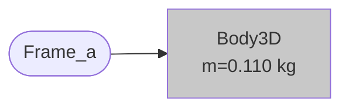

The `FreeMotion` joint connects the body to the world frame and introduces all 6 DOF automatically. Euler angles are selected with `useQuaternions = false`:

```modelica
MultiBody.Joints.FreeMotion freeMotion(
    r_rel_a(start = {0, 0, 1.0}, each fixed = true),  // start at z = 1m
    useQuaternions = false,
    sequence_angleStates = {1, 2, 3});  // roll-pitch-yaw
```

MSL handles the full rotational kinematics internally — gyroscopic coupling, Coriolis terms, everything. We just declare the body and connect forces.

### Free Fall Validation

Drop the body from 1m with no thrust. Pure gravity: $z(t) = 1 - \tfrac{1}{2}g t^2$. It should hit $z = 0$ at $t = \sqrt{2/g} \approx 0.452$ s.


### Angular Momentum Conservation

Give the body an initial yaw rate $\dot\psi_0 = 10$ deg/s and no external torques. Angular momentum must be exactly conserved. The top-down view (right) shows the yaw rotation clearly — the forward indicator (pink line) sweeps smoothly.


---

## 2. Rotors: Thrust + Reaction Torque

Each motor produces two effects:

**Thrust** along the body Z-axis (upward):

$$F_{\text{thrust}} = \begin{bmatrix} 0 \\ 0 \\ f \end{bmatrix}_{\text{body}} \qquad f \in [0,\ f_{\max}]$$

**Reaction torque** about the body Z-axis (Newton's third law — spinning the prop creates a torque on the frame):

$$\tau_{\text{reaction}} = \begin{bmatrix} 0 \\ 0 \\ \pm\, k_t \cdot f \end{bmatrix}_{\text{body}}$$

where $k_t = 0.01$ N-m/N and the sign depends on spin direction: CCW motors (+) resist yaw left, CW motors (-) resist yaw right.

```modelica
Drone3D.Actuators.Rotor rotor1(direction = +1);  // front-left, CCW
Drone3D.Actuators.Rotor rotor2(direction = -1);  // front-right, CW
Drone3D.Actuators.Rotor rotor3(direction = -1);  // rear-left, CW
Drone3D.Actuators.Rotor rotor4(direction = +1);  // rear-right, CCW
```

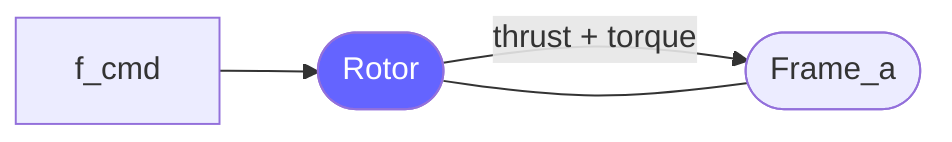

The 4 rotors are placed at the ends of X-shaped arms via `FixedTranslation`:

```modelica
parameter Real L = 0.076;  // arm half-length [m]

MultiBody.Parts.FixedTranslation arm1(r = {+L, +L, 0});  // front-left
MultiBody.Parts.FixedTranslation arm2(r = {+L, -L, 0});  // front-right
MultiBody.Parts.FixedTranslation arm3(r = {-L, +L, 0});  // rear-left
MultiBody.Parts.FixedTranslation arm4(r = {-L, -L, 0});  // rear-right
```

---

## 3. Motor Mixing: Controller Commands to Motor Forces

The flight controller thinks in terms of **throttle** (total lift), **roll**, **pitch**, and **yaw** commands. The mixing matrix converts these to individual motor forces — exactly matching the Airbit 2 firmware:

$$\begin{bmatrix} f_1 \\ f_2 \\ f_3 \\ f_4 \end{bmatrix} = \begin{bmatrix} 1 & +1 & +1 & +1 \\ 1 & -1 & +1 & -1 \\ 1 & +1 & -1 & -1 \\ 1 & -1 & -1 & +1 \end{bmatrix} \begin{bmatrix} \text{throttle} \\ \text{roll\_cmd} \\ \text{pitch\_cmd} \\ \text{yaw\_cmd} \end{bmatrix}$$

Each output is clamped to $[0, f_{\max}]$. This means aggressive commands saturate motors — the drone has only 35% thrust margin above hover.

```modelica
Drone3D.Actuators.MixingMatrix mixer;
// f1 = clamp(throttle + roll + pitch + yaw, 0, 0.363)
// f2 = clamp(throttle - roll + pitch - yaw, 0, 0.363)
// f3 = clamp(throttle + roll - pitch - yaw, 0, 0.363)
// f4 = clamp(throttle - roll - pitch + yaw, 0, 0.363)
```

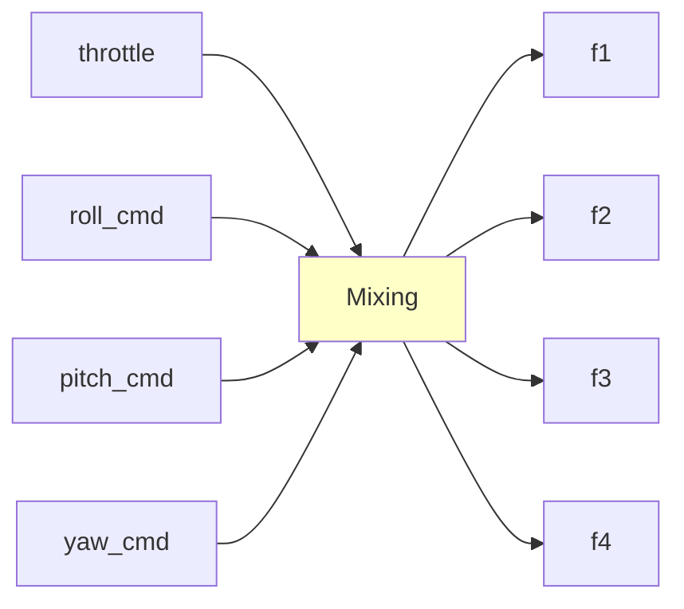

---

## 4. Sensor Fusion: Complementary Filter

The drone has no GPS — just an IMU (accelerometer + gyroscope) and a barometer. The complementary filter fuses these to estimate attitude:

**Accelerometer** gives the gravity direction (→ tilt angle), but is noisy and corrupted by drone acceleration.

**Gyroscope** gives angular rate (integrate → angle), but drifts over time from bias.

The filter blends both — trusting the gyro for fast changes and the accelerometer for long-term correction:

$$\dot{\hat\phi} = g_x + K \cdot (\phi_{\text{accel}} - \hat\phi)$$

$$\dot{\hat\theta} = g_y + K \cdot (\theta_{\text{accel}} - \hat\theta)$$

$$\dot{\hat\psi} = g_z \qquad \text{(gyro only — no magnetometer)}$$

where:

$$\phi_{\text{accel}} = \text{atan2}(a_y,\; a_z) \qquad \theta_{\text{accel}} = \text{atan2}(-a_x,\; a_z)$$

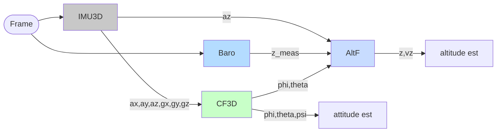

The gain $K = 0.505$ maps exactly to the firmware's discrete filter with $\alpha = 0.99$:

$$K = \frac{1 - \alpha}{\alpha \cdot \Delta t} = \frac{0.01}{0.99 \times 0.02} \approx 0.505$$

This means 99% gyro trust, 1% accelerometer correction per step.

**Yaw has no correction** — it integrates gyro only and drifts ~1 deg/s. The real Airbit 2 has no magnetometer in flight mode, so this matches reality.

---

## 5. Control: Cascaded PD/PID

Drone control uses two nested loops:

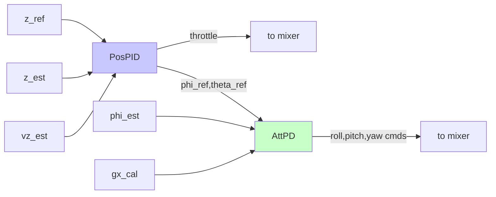

### Outer Loop: Altitude PID

The altitude controller computes a throttle command to track a reference altitude $z_{\text{ref}}$:

$$e_z = z_{\text{ref}} - z_{\text{est}}$$

$$\dot{i}_z = K_i \cdot e_z \qquad (\text{clamped to } \pm i_{\max})$$

$$F_{\text{corr}} = K_p \cdot e_z - K_d \cdot \dot{z}_{\text{est}} + i_z$$

$$\text{throttle} = \frac{m g + F_{\text{corr}}}{4}$$

The $mg$ term is **feedforward** — it pre-computes the thrust needed to hover, so the PID only corrects errors. The integral term $i_z$ eliminates steady-state drift from sensor bias.

| Gain | Value | Role |
|------|-------|------|
| $K_p$ | 2.0 | Stiffness — how hard it pushes toward target |
| $K_d$ | 1.0 | Damping — prevents oscillation |
| $K_i$ | 1.0 | Integral — eliminates steady-state error |
| $i_{\max}$ | 5.0 N | Anti-windup clamp |

### Inner Loop: Attitude PD

The attitude controller stabilizes roll, pitch, and yaw using gyro rate as the D-term (not error derivative — this is how real flight controllers work):

$$\text{roll\_cmd} = K_p^\phi (\phi_{\text{ref}} - \phi_{\text{est}}) - K_d^\phi \cdot g_x$$

$$\text{pitch\_cmd} = -\left[K_p^\theta (\theta_{\text{ref}} - \theta_{\text{est}}) - K_d^\theta \cdot g_y\right]$$

$$\text{yaw\_cmd} = K_p^\psi (\psi_{\text{ref}} - \psi_{\text{est}}) - K_d^\psi \cdot g_z$$

The pitch sign is **negated** because MSL's Euler {1,2,3} convention has the opposite torque direction from the firmware mixer.

All commands are clamped to $\pm \text{cmd\_max}$ to prevent mixer saturation. With inertia $I \sim 5 \times 10^{-5}$ kg-m², any saturated command produces $900+$ rad/s² angular acceleration — the drone tumbles in 0.1 seconds.

```modelica
Drone3D.Control.AttitudePD3D attPD(
    Kp_roll = 0.1, Kd_roll = 0.008,   // reduced for motor lag stability
    Kp_pitch = 0.1, Kd_pitch = 0.008,
    Kp_yaw = 0.1, Kd_yaw = 0.015,
    cmd_max = 0.01);                   // critical: prevents mixer saturation
```

---

## 6. Assembly: Wiring It All Together

Here's how the core components connect — our minimum viable digital twin:

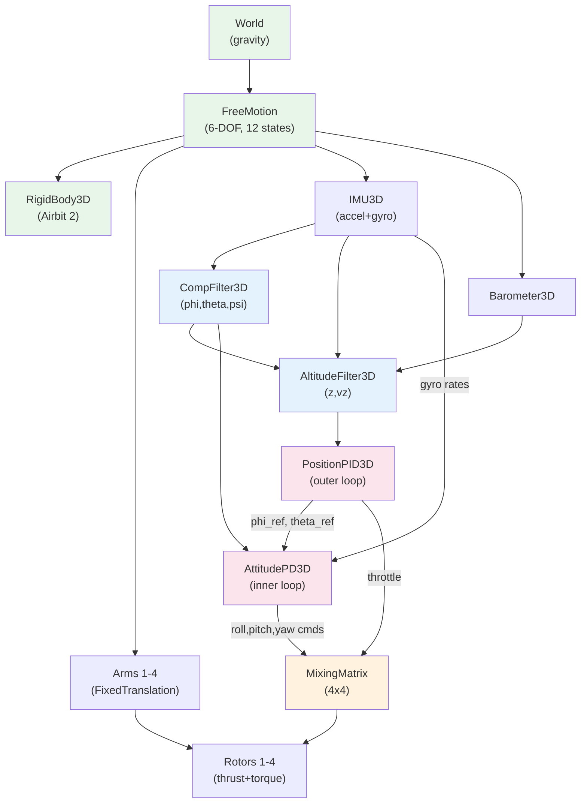

The entire assembly is ~60 lines of Modelica `connect` statements. No manual equation bookkeeping — MSL handles the multibody dynamics, and Modelica's acausal connector system resolves the full system of DAEs.

In Modelica, this is just `connect` statements:

```modelica
// Physical structure
connect(world.frame_b, freeMotion.frame_a);
connect(freeMotion.frame_b, rigidBody.frame_a);
connect(freeMotion.frame_b, arm1.frame_a);
connect(arm1.frame_b, rotor1.frame_a);
// ... repeat for arms 2-4

// Sensor chain
connect(imu.ax, compFilter.ax);
connect(imu.gz, compFilter.gz);
// ... all 6 IMU channels

// Control chain
connect(altFilter.z_est, posPID.z_est);
connect(posPID.throttle, mixer.throttle);
connect(attPD.roll_cmd, mixer.roll_cmd);
connect(mixer.f1, rotor1.f_cmd);
```

This assembly has no motor lag (instant thrust), no ground contact, no wind, and no battery. It's the simplest thing that can hover — and we'll use it to validate the flight controller before adding complexity.

---

# Part II: First Flight

---

## 7. Hovering with Noise

The drone starts at z = 1m and holds position with noisy sensors (accelerometer bias 0.002 m/s², gyro bias 0.001 rad/s, barometer noise 0.15m). Each motor produces $mg/4 = 0.269$ N (74% of max thrust). The 26% margin allows corrections but limits aggressiveness.

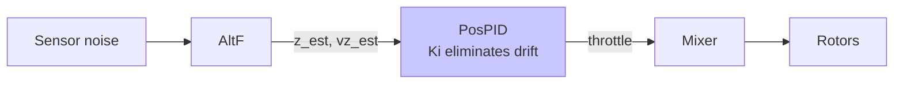

The altitude plot shows the PID fighting sensor noise in real time — the altitude wiggles $\pm 4$ cm around the target but never drifts away. This is the integral term at work: without it ($K_i = 0$), the accelerometer bias would cause a steady drift of ~0.04 m/s and the drone would hit the ground within 25 seconds.


---

## 8. Yaw Control: Spinning 360 Degrees

Yaw rotation uses **reaction torque** — the equal-and-opposite torque from spinning propellers. To yaw left (CCW), increase thrust on CW motors (M2, M3) and decrease on CCW motors (M1, M4). Net thrust stays constant; net torque rotates the frame.

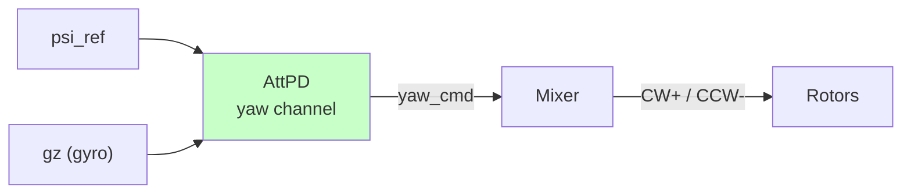

We command a 360-degree yaw ramp over 10 seconds (36 deg/s):

$$\psi_{\text{ref}}(t) = \begin{cases} 0 & t < 3 \\ \frac{2\pi}{10}(t - 3) & 3 \leq t \leq 13 \\ 2\pi & t > 13 \end{cases}$$

The yaw controller tracks this while altitude and roll/pitch remain undisturbed — demonstrating that the yaw channel is decoupled at low rates.


Notice the motor force differential: during yaw ramp, CW motors increase and CCW motors decrease (or vice versa) while the average stays at hover thrust.

---

## 9. Roll Step: Attitude-Altitude Coupling

Command a 10-degree roll step and watch what happens to altitude.

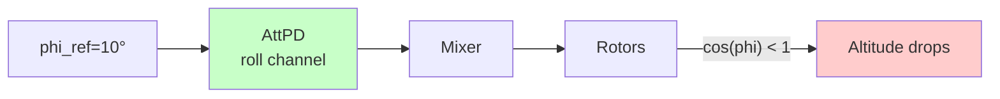

When the drone tilts, the vertical component of thrust drops by $\cos(\phi)$:

$$F_{\text{vertical}} = F_{\text{total}} \cos\phi = mg \cdot \cos(10°) \approx 0.985 \cdot mg$$

That's only a 1.5% reduction, but there's a bigger problem: the **accelerometer can't detect the tilt**. During powered flight, the thrust along body-Z cancels the gravity signal the accelerometer uses to measure tilt. The complementary filter relies on the gyro alone to track the roll angle.

With noisy gyro, the altitude filter misestimates the vertical acceleration projection, causing an altitude drop much larger than the 1.5% thrust reduction would predict.


The attitude response is extremely fast (rise time ~0.035s) because the roll inertia is tiny: $I_{xx} = 4 \times 10^{-5}$ kg-m². This means even small torques produce massive angular accelerations.

---

## 10. Lateral Motion: Tilt to Translate

A multirotor has no direct lateral thrust. To move sideways, it **tilts** — redirecting part of its vertical thrust horizontally:

$$a_{x,\text{des}} = K_p^x (x_{\text{ref}} - x) - K_d^x \dot{x}$$

$$\theta_{\text{ref}} = \text{clamp}\!\left(\frac{a_{x,\text{des}}}{g},\ -\theta_{\max},\ \theta_{\max}\right)$$

The tilt angle is clamped to 15 degrees for stability. At the Airbit 2's thrust-to-weight ratio of 1.35, even 15 degrees leaves very little vertical thrust margin.

Lateral control requires a new component — `PositionPID3D_Lateral` — which merges altitude PID with lateral PD, computing tilt references from XY position error:

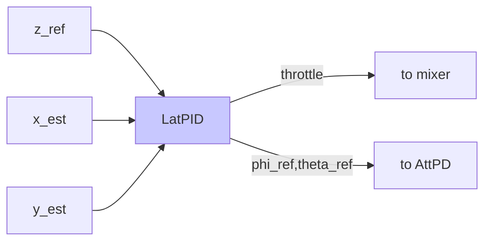

The assembly grows — a `PositionSensor3D` now feeds world-frame XY position to the lateral controller:

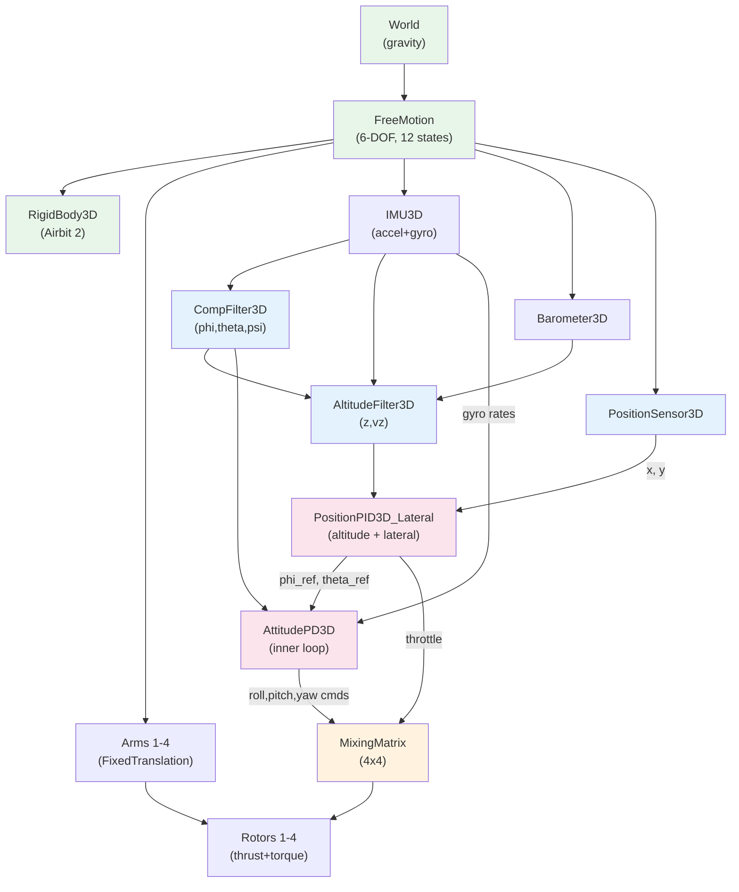

### Square Waypoint Path

The drone tracks 4 waypoints forming a square: $(0,0) \to (0.5, 0) \to (0.5, 0.5) \to (0, 0.5) \to (0, 0)$.


The conservative tilt limit means the drone moves slowly but maintains excellent altitude hold (within a few centimeters).

---

# Part III: Closing the Reality Gap

We've been flying with instant motors, no wind, no ground contact, and an infinite battery. The real Airbit 2 has none of these luxuries. Time to close the gap.

---

## 11. Motor Dynamics: Why Lag Matters

Real motors don't respond instantly. The thrust follows a first-order lag:

$$\tau_m \frac{df}{dt} = f_{\text{cmd}} - f \qquad \tau_m = 30 \text{ ms}$$

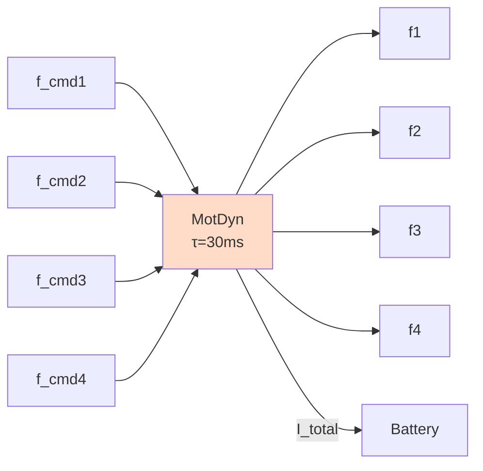

With ideal sensors, 30ms lag is benign — the system is much slower than the motor. But add sensor noise and the story changes dramatically.

The attitude controller's natural frequency ($\omega_n \approx 112$ rad/s with $K_p = 0.5$) **exceeds the motor bandwidth** ($1/\tau_m = 33$ rad/s). The motor can't keep up, introduces phase lag, and the noisy feedback creates a positive feedback loop.

Result: **tumble divergence within 1.5 seconds**.


**The fix**: reduce attitude gains 5x ($K_p: 0.5 \to 0.1$) so the controller bandwidth stays below the motor bandwidth. This is the single most important finding from the simulation — and it would be discovered the hard way (crash) on real hardware.


The assembly now routes mixer output through motor dynamics before reaching the rotors:

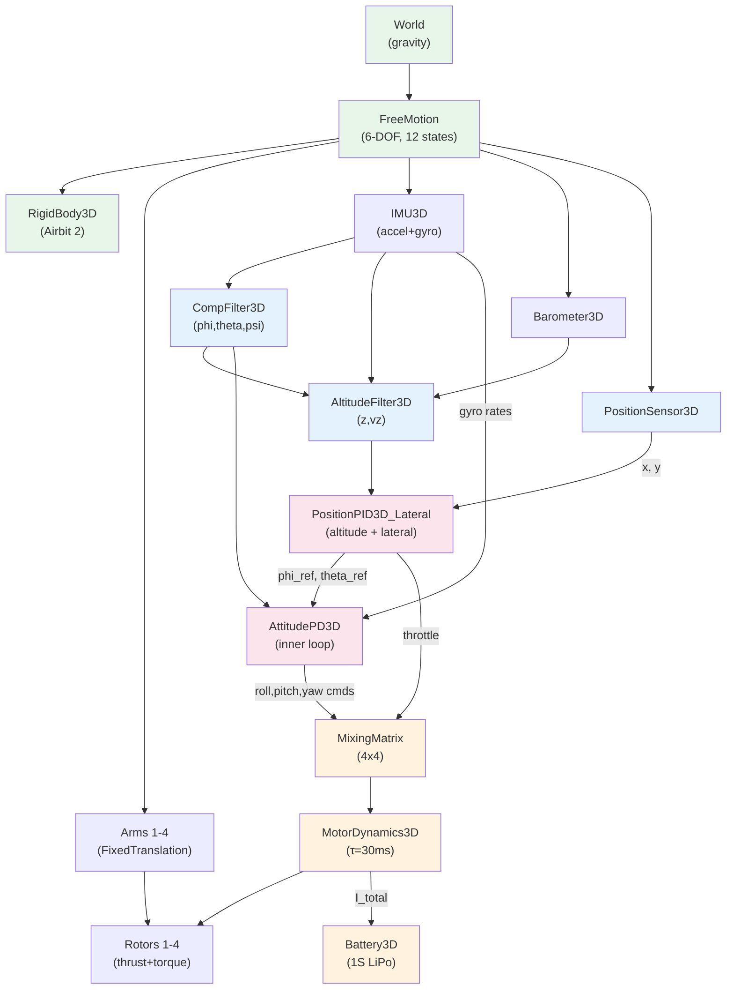

---

## 12. Environment: Wind, Ground, and Battery

Three components close the remaining reality gap.

### Wind Disturbance

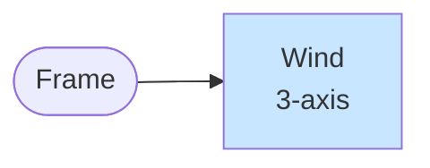

A 0.3N downdraft (28% of drone weight) hits at $t = 10$ s for 5 seconds. The PID controller detects the altitude drop and increases thrust to compensate:


The altitude dips ~13.5 cm and recovers within 5 seconds after the wind stops. The integral action in the PID is what enables full recovery to the target altitude.

### Ground Contact

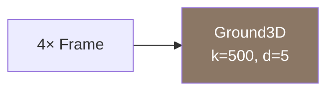

The ground is modeled as 4 spring-damper contact points (one per landing leg):

$$F_{z,i} = \begin{cases} -k_g z_i - d_g \dot{z}_i & \text{if } z_i < 0 \\ 0 & \text{otherwise} \end{cases}$$

with $k_g = 500$ N/m, $d_g = 5$ N-s/m. This lets the simulation handle takeoff, landing, and ground-start scenarios.


### Battery Drain

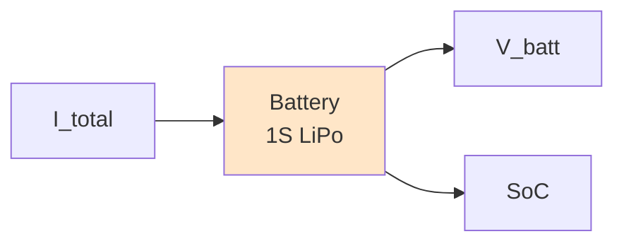

The battery model tracks state-of-charge via Coulomb counting:

$$\frac{d(\text{SoC})}{dt} = -\frac{I_{\text{draw}}}{C_{\text{nom}} \times 3600}$$

$$V_{\text{batt}} = V_{\text{oc}}({\text{SoC}}) - R_{\text{int}} \cdot I_{\text{draw}}$$

At hover, the total current is ~0.4A, voltage sags from 4.2V to ~4.13V, and the estimated flight time is ~120 minutes (with the 800 mAh battery).


---

## 13. Pushing the Limits: Abrupt Maneuver

Now push the drone harder. An aggressive 1-meter square path with abrupt 90-degree direction changes every 3 seconds:

$(0,0) \to (1,0) \to (1,1) \to (0,1) \to (0,0)$

The lateral gains are doubled ($K_p^x = 1.0$) and tilt limit raised to 25 degrees. At each waypoint transition, the drone must simultaneously decelerate in one axis and accelerate in another — demanding maximum motor authority.


During the 90-degree turns, motor forces hit saturation (0.363 N) as the mixing matrix tries to maintain altitude while commanding aggressive tilt. The 35% thrust margin above hover gets consumed by the sustained 25-degree tilt, which reduces vertical thrust by $1 - \cos(25°) = 9.4\%$.

This is where TWR = 1.35 matters most: with only 26% margin, the drone can barely maintain altitude during aggressive lateral motion. A heavier drone or weaker motors would crash.

---

## Key Takeaways

1. **Modelica's MSL eliminates manual Newton-Euler**: `MultiBody.Parts.Body` + `FreeMotion` gives you 6-DOF dynamics for free. No rotation matrix bugs.

2. **Acausal connectors = plug-and-play**: swap PD for PID, add motor lag, add battery — each is an independent block. The compiler resolves the math.

3. **Motor lag is the hidden killer**: 30ms lag is invisible in ideal conditions but destabilizes the attitude loop with noisy sensors. Simulation found this; real hardware would have crashed.

4. **The accelerometer can't see tilt during flight**: thrust along body-Z cancels the gravity signal. The complementary filter relies on gyro alone for tilt tracking — explaining why real drones drift.

5. **TWR = 1.35 limits everything**: with only 26% thrust margin above hover, the drone can't do aggressive maneuvers. Every controller gain must respect this constraint.

6. **Simulation matches firmware exactly**: the mixing matrix, complementary filter gains, and sensor noise parameters are all taken directly from the Airbit 2 source code and MPU6050 datasheet.

---

*Built with [OpenModelica](https://openmodelica.org/) v1.26.3. All source code, models, and animations are in the [`drone`](.) repository.*
