*Un guide étape par étape pour simuler un quadrirotor avec OpenModelica et la Modelica Standard Library.*


---

## Ce que nous construisons

Nous simulons le **Airbit 2** — un vrai quadrirotor de 110 grammes alimenté par micro:bit — sous forme de jumeau numérique 3D complet. Chaque composant (moteurs, batterie, capteurs, contrôleur) est modélisé comme un bloc Modelica séparé, câblé ensemble comme le matériel réel.

Le résultat : une simulation qui prédit comment le vrai drone vole, fait du vol stationnaire, suit des points de passage et réagit aux perturbations — avant même le décollage.

| Paramètre | Valeur |
|-----------|--------|
| Masse | 110 g |
| Longueur de bras | 76 mm (CdM au moteur) |
| Poussée max/moteur | 0.363 N |
| Rapport poussée/poids | 1.35 |
| Batterie | 1S LiPo, 800 mAh |
| IMU | MPU6050 (accéléromètre + gyroscope) |
| Inertie (roulis / tangage / lacet) | 4e-5 / 6e-5 / 9e-5 kg-m² |

---

## Vol stationnaire : le résultat final

Avant d'expliquer le comment — voici ce que le jumeau numérique complet peut faire. Le drone démarre décalé à (0.3m, 0.2m, 0.5m) — mauvaise position sur les 3 axes — et doit converger vers (0, 0, 1.0m).

Le PID d'altitude élimine la dérive verticale due au biais des capteurs. Le PD latéral incline le drone vers la cible XY. Les 3 axes convergent en quelques secondes.


Comment un drone de 110g maintient-il sa position sur 3 axes ? Construisons-le composant par composant.

---

# Partie I : Construire le jumeau numérique

---

## 1. Le corps rigide : 6 degrés de liberté

Un drone en 3D possède 12 états : position $(x, y, z)$, vitesse $(v_x, v_y, v_z)$, orientation $(\phi, \theta, \psi)$ — roulis, tangage, lacet — et vitesse angulaire $(p, q, r)$.

En Modelica, on n'écrit pas les équations de Newton-Euler à la main. On utilise plutôt le composant MSL `MultiBody.Parts.Body` :

```modelica
Drone3D.Mechanics.RigidBody3D rigidBody;
// Wraps MultiBody.Parts.Body with Airbit 2 inertia:
//   m = 0.110 kg
//   I_xx = 4e-5 kg·m²  (roll)
//   I_yy = 6e-5 kg·m²  (pitch)
//   I_zz = 9e-5 kg·m²  (yaw)
```

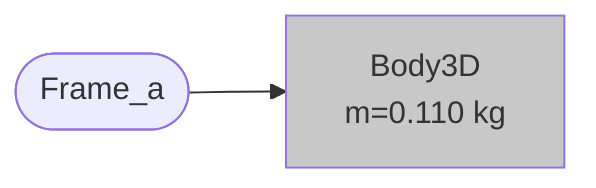

Le joint `FreeMotion` connecte le corps au repère mondial et introduit automatiquement les 6 DOF. Les angles d'Euler sont sélectionnés avec `useQuaternions = false` :

```modelica
MultiBody.Joints.FreeMotion freeMotion(
    r_rel_a(start = {0, 0, 1.0}, each fixed = true),  // start at z = 1m
    useQuaternions = false,
    sequence_angleStates = {1, 2, 3});  // roll-pitch-yaw
```

La MSL gère toute la cinématique rotationnelle en interne — couplage gyroscopique, termes de Coriolis, tout. On déclare simplement le corps et on connecte les forces.

### Validation en chute libre

Lâcher le corps depuis 1m sans poussée. Gravité pure : $z(t) = 1 - \tfrac{1}{2}g t^2$. Il devrait atteindre $z = 0$ à $t = \sqrt{2/g} \approx 0.452$ s.


### Conservation du moment cinétique

Donner au corps une vitesse de lacet initiale $\dot\psi_0 = 10$ deg/s sans couple externe. Le moment cinétique doit être exactement conservé. La vue du dessus (droite) montre clairement la rotation en lacet — l'indicateur avant (ligne rose) balaye de façon régulière.


---

## 2. Rotors : poussée + couple de réaction

Chaque moteur produit deux effets :

**Poussée** le long de l'axe Z du corps (vers le haut) :

$$F_{\text{thrust}} = \begin{bmatrix} 0 \\ 0 \\ f \end{bmatrix}_{\text{body}} \qquad f \in [0,\ f_{\max}]$$

**Couple de réaction** autour de l'axe Z du corps (troisième loi de Newton — la rotation de l'hélice crée un couple sur le châssis) :

$$\tau_{\text{reaction}} = \begin{bmatrix} 0 \\ 0 \\ \pm\, k_t \cdot f \end{bmatrix}_{\text{body}}$$

où $k_t = 0.01$ N-m/N et le signe dépend du sens de rotation : les moteurs CCW (+) résistent au lacet gauche, les moteurs CW (-) résistent au lacet droit.

```modelica
Drone3D.Actuators.Rotor rotor1(direction = +1);  // front-left, CCW
Drone3D.Actuators.Rotor rotor2(direction = -1);  // front-right, CW
Drone3D.Actuators.Rotor rotor3(direction = -1);  // rear-left, CW
Drone3D.Actuators.Rotor rotor4(direction = +1);  // rear-right, CCW
```

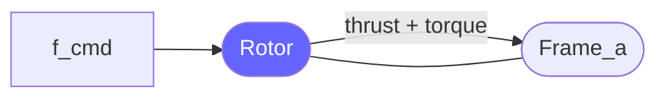

Les 4 rotors sont placés aux extrémités de bras en X via `FixedTranslation` :

```modelica
parameter Real L = 0.076;  // arm half-length [m]

MultiBody.Parts.FixedTranslation arm1(r = {+L, +L, 0});  // front-left
MultiBody.Parts.FixedTranslation arm2(r = {+L, -L, 0});  // front-right
MultiBody.Parts.FixedTranslation arm3(r = {-L, +L, 0});  // rear-left
MultiBody.Parts.FixedTranslation arm4(r = {-L, -L, 0});  // rear-right
```

---

## 3. Matrice de mixage : des commandes du contrôleur aux forces moteurs

Le contrôleur de vol raisonne en termes de **gaz** (portance totale), **roulis**, **tangage** et **lacet**. La matrice de mixage convertit ces commandes en forces moteurs individuelles — reproduisant exactement le firmware du Airbit 2 :

$$\begin{bmatrix} f_1 \\ f_2 \\ f_3 \\ f_4 \end{bmatrix} = \begin{bmatrix} 1 & +1 & +1 & +1 \\ 1 & -1 & +1 & -1 \\ 1 & +1 & -1 & -1 \\ 1 & -1 & -1 & +1 \end{bmatrix} \begin{bmatrix} \text{throttle} \\ \text{roll\_cmd} \\ \text{pitch\_cmd} \\ \text{yaw\_cmd} \end{bmatrix}$$

Chaque sortie est limitée à $[0, f_{\max}]$. Cela signifie que les commandes agressives saturent les moteurs — le drone n'a que 35% de marge de poussée au-dessus du vol stationnaire.

```modelica
Drone3D.Actuators.MixingMatrix mixer;
// f1 = clamp(throttle + roll + pitch + yaw, 0, 0.363)
// f2 = clamp(throttle - roll + pitch - yaw, 0, 0.363)
// f3 = clamp(throttle + roll - pitch - yaw, 0, 0.363)
// f4 = clamp(throttle - roll - pitch + yaw, 0, 0.363)
```

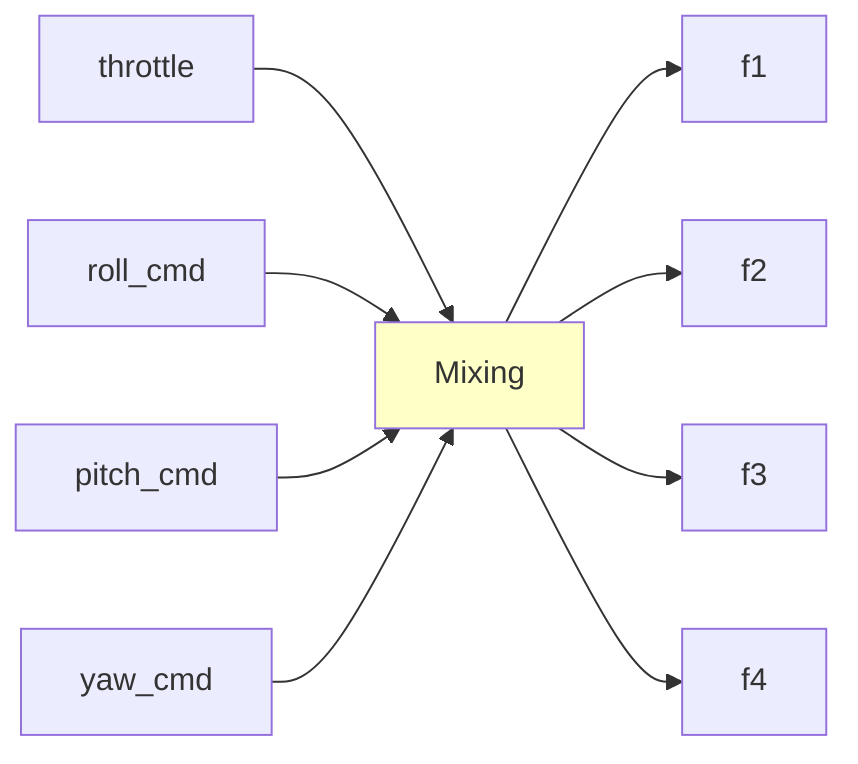

---

## 4. Fusion de capteurs : filtre complémentaire

Le drone n'a pas de GPS — juste une IMU (accéléromètre + gyroscope) et un baromètre. Le filtre complémentaire fusionne ces données pour estimer l'attitude :

**L'accéléromètre** donne la direction de la gravité (→ angle d'inclinaison), mais est bruité et corrompu par l'accélération du drone.

**Le gyroscope** donne la vitesse angulaire (intégrer → angle), mais dérive au fil du temps à cause du biais.

Le filtre combine les deux — faisant confiance au gyroscope pour les changements rapides et à l'accéléromètre pour la correction à long terme :

$$\dot{\hat\phi} = g_x + K \cdot (\phi_{\text{accel}} - \hat\phi)$$

$$\dot{\hat\theta} = g_y + K \cdot (\theta_{\text{accel}} - \hat\theta)$$

$$\dot{\hat\psi} = g_z \qquad \text{(gyro only — no magnetometer)}$$

où :

$$\phi_{\text{accel}} = \text{atan2}(a_y,\; a_z) \qquad \theta_{\text{accel}} = \text{atan2}(-a_x,\; a_z)$$

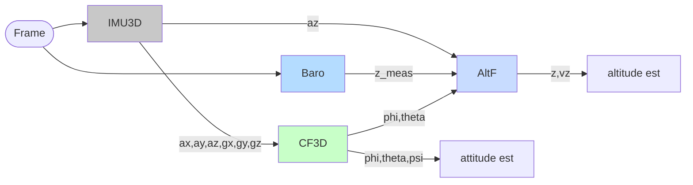

Le gain $K = 0.505$ correspond exactement au filtre discret du firmware avec $\alpha = 0.99$ :

$$K = \frac{1 - \alpha}{\alpha \cdot \Delta t} = \frac{0.01}{0.99 \times 0.02} \approx 0.505$$

Cela signifie 99% de confiance au gyroscope, 1% de correction par l'accéléromètre à chaque pas.

**Le lacet n'a pas de correction** — il intègre uniquement le gyroscope et dérive d'environ 1 deg/s. Le vrai Airbit 2 n'a pas de magnétomètre en mode vol, donc cela correspond à la réalité.

---

## 5. Contrôle : PD/PID en cascade

Le contrôle du drone utilise deux boucles imbriquées :

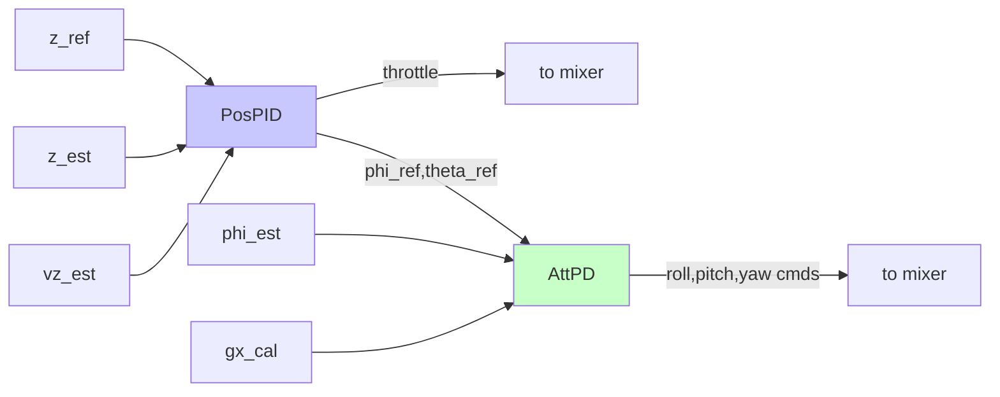

### Boucle externe : PID d'altitude

Le contrôleur d'altitude calcule une commande de gaz pour suivre une altitude de référence $z_{\text{ref}}$ :

$$e_z = z_{\text{ref}} - z_{\text{est}}$$

$$\dot{i}_z = K_i \cdot e_z \qquad (\text{clamped to } \pm i_{\max})$$

$$F_{\text{corr}} = K_p \cdot e_z - K_d \cdot \dot{z}_{\text{est}} + i_z$$

$$\text{throttle} = \frac{m g + F_{\text{corr}}}{4}$$

Le terme $mg$ est un **feedforward** — il pré-calcule la poussée nécessaire au vol stationnaire, de sorte que le PID ne corrige que les erreurs. Le terme intégral $i_z$ élimine l'erreur statique due au biais des capteurs.

| Gain | Valeur | Rôle |
|------|--------|------|
| $K_p$ | 2.0 | Raideur — force de rappel vers la cible |
| $K_d$ | 1.0 | Amortissement — empêche les oscillations |
| $K_i$ | 1.0 | Intégral — élimine l'erreur statique |
| $i_{\max}$ | 5.0 N | Limitation anti-windup |

### Boucle interne : PD d'attitude

Le contrôleur d'attitude stabilise le roulis, le tangage et le lacet en utilisant la vitesse angulaire du gyroscope comme terme D (pas la dérivée de l'erreur — c'est ainsi que fonctionnent les vrais contrôleurs de vol) :

$$\text{roll\_cmd} = K_p^\phi (\phi_{\text{ref}} - \phi_{\text{est}}) - K_d^\phi \cdot g_x$$

$$\text{pitch\_cmd} = -\left[K_p^\theta (\theta_{\text{ref}} - \theta_{\text{est}}) - K_d^\theta \cdot g_y\right]$$

$$\text{yaw\_cmd} = K_p^\psi (\psi_{\text{ref}} - \psi_{\text{est}}) - K_d^\psi \cdot g_z$$

Le signe du tangage est **inversé** car la convention d'Euler {1,2,3} de la MSL a la direction de couple opposée à celle du firmware du mixeur.

Toutes les commandes sont limitées à $\pm \text{cmd\_max}$ pour éviter la saturation du mixeur. Avec une inertie $I \sim 5 \times 10^{-5}$ kg-m², toute commande saturée produit une accélération angulaire de plus de 900 rad/s² — le drone bascule en 0.1 seconde.

```modelica
Drone3D.Control.AttitudePD3D attPD(
    Kp_roll = 0.1, Kd_roll = 0.008,   // reduced for motor lag stability
    Kp_pitch = 0.1, Kd_pitch = 0.008,
    Kp_yaw = 0.1, Kd_yaw = 0.015,
    cmd_max = 0.01);                   // critical: prevents mixer saturation
```

---

## 6. Assemblage : tout câbler ensemble

Voici comment les composants principaux se connectent — notre jumeau numérique minimal viable :

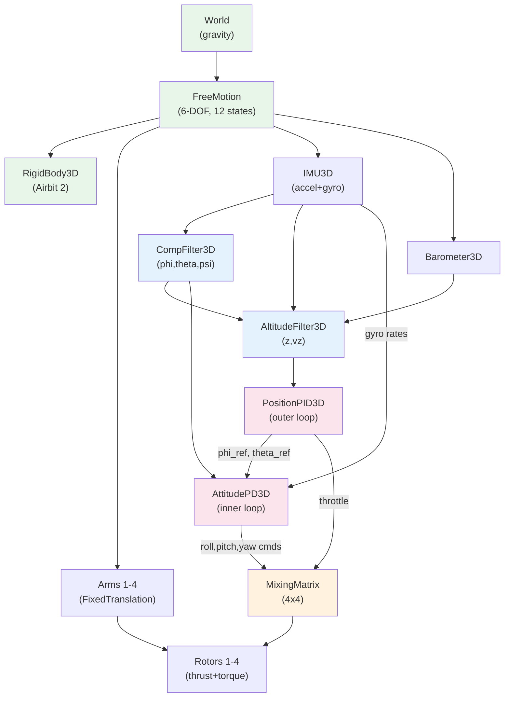

L'assemblage complet fait environ 60 lignes d'instructions `connect` en Modelica. Pas de gestion manuelle d'équations — la MSL gère la dynamique multicorps, et le système de connecteurs acausaux de Modelica résout le système complet de DAE.

En Modelica, ce ne sont que des instructions `connect` :

```modelica
// Physical structure
connect(world.frame_b, freeMotion.frame_a);
connect(freeMotion.frame_b, rigidBody.frame_a);
connect(freeMotion.frame_b, arm1.frame_a);
connect(arm1.frame_b, rotor1.frame_a);
// ... repeat for arms 2-4

// Sensor chain
connect(imu.ax, compFilter.ax);
connect(imu.gz, compFilter.gz);
// ... all 6 IMU channels

// Control chain
connect(altFilter.z_est, posPID.z_est);
connect(posPID.throttle, mixer.throttle);
connect(attPD.roll_cmd, mixer.roll_cmd);
connect(mixer.f1, rotor1.f_cmd);
```

Cet assemblage n'a pas de retard moteur (poussée instantanée), pas de contact au sol, pas de vent et pas de batterie. C'est la chose la plus simple capable de faire du vol stationnaire — et nous l'utiliserons pour valider le contrôleur de vol avant d'ajouter de la complexité.

---

# Partie II : Premier vol

---

## 7. Vol stationnaire avec bruit

Le drone démarre à z = 1m et maintient sa position avec des capteurs bruités (biais accéléromètre 0.002 m/s², biais gyroscope 0.001 rad/s, bruit baromètre 0.15m). Chaque moteur produit $mg/4 = 0.269$ N (74% de la poussée max). La marge de 26% permet des corrections mais limite l'agressivité.

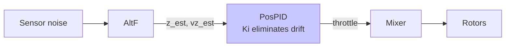

Le graphique d'altitude montre le PID luttant contre le bruit des capteurs en temps réel — l'altitude oscille de $\pm 4$ cm autour de la cible mais ne dérive jamais. C'est le terme intégral qui agit : sans lui ($K_i = 0$), le biais de l'accéléromètre causerait une dérive constante d'environ 0.04 m/s et le drone toucherait le sol en 25 secondes.


---

## 8. Contrôle en lacet : rotation de 360 degrés

La rotation en lacet utilise le **couple de réaction** — le couple égal et opposé dû à la rotation des hélices. Pour lacer à gauche (CCW), on augmente la poussée sur les moteurs CW (M2, M3) et on la diminue sur les moteurs CCW (M1, M4). La poussée nette reste constante ; le couple net fait tourner le châssis.

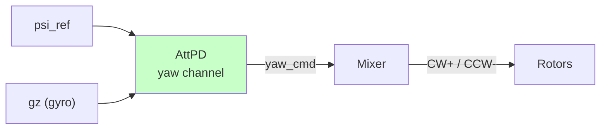

On commande une rampe de lacet de 360 degrés sur 10 secondes (36 deg/s) :

$$\psi_{\text{ref}}(t) = \begin{cases} 0 & t < 3 \\ \frac{2\pi}{10}(t - 3) & 3 \leq t \leq 13 \\ 2\pi & t > 13 \end{cases}$$

Le contrôleur de lacet suit cette consigne tandis que l'altitude et le roulis/tangage restent imperturbés — démontrant que le canal de lacet est découplé à basses vitesses.


Notez le différentiel de force moteur : pendant la rampe de lacet, les moteurs CW augmentent et les moteurs CCW diminuent (ou vice versa) tandis que la moyenne reste à la poussée de vol stationnaire.

---

## 9. Échelon de roulis : couplage attitude-altitude

Commander un échelon de roulis de 10 degrés et observer ce qui arrive à l'altitude.

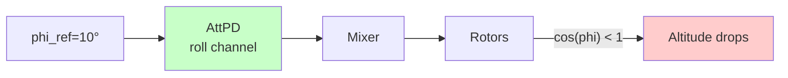

Quand le drone s'incline, la composante verticale de la poussée diminue de $\cos(\phi)$ :

$$F_{\text{vertical}} = F_{\text{total}} \cos\phi = mg \cdot \cos(10°) \approx 0.985 \cdot mg$$

C'est seulement une réduction de 1.5%, mais il y a un problème plus important : **l'accéléromètre ne peut pas détecter l'inclinaison**. En vol motorisé, la poussée le long de l'axe Z du corps annule le signal de gravité que l'accéléromètre utilise pour mesurer l'inclinaison. Le filtre complémentaire s'appuie uniquement sur le gyroscope pour suivre l'angle de roulis.

Avec un gyroscope bruité, le filtre d'altitude estime mal la projection de l'accélération verticale, causant une chute d'altitude bien plus importante que la réduction de poussée de 1.5% ne le prédirait.


La réponse en attitude est extrêmement rapide (temps de montée ~0.035s) car l'inertie en roulis est minuscule : $I_{xx} = 4 \times 10^{-5}$ kg-m². Cela signifie que même de petits couples produisent des accélérations angulaires massives.

---

## 10. Mouvement latéral : s'incliner pour se déplacer

Un multirotor n'a pas de poussée latérale directe. Pour se déplacer latéralement, il **s'incline** — redirigeant une partie de sa poussée verticale horizontalement :

$$a_{x,\text{des}} = K_p^x (x_{\text{ref}} - x) - K_d^x \dot{x}$$

$$\theta_{\text{ref}} = \text{clamp}\!\left(\frac{a_{x,\text{des}}}{g},\ -\theta_{\max},\ \theta_{\max}\right)$$

L'angle d'inclinaison est limité à 15 degrés pour la stabilité. Avec le rapport poussée/poids de 1.35 du Airbit 2, même 15 degrés laissent très peu de marge de poussée verticale.

Le contrôle latéral nécessite un nouveau composant — `PositionPID3D_Lateral` — qui fusionne le PID d'altitude avec le PD latéral, calculant les références d'inclinaison à partir de l'erreur de position XY :

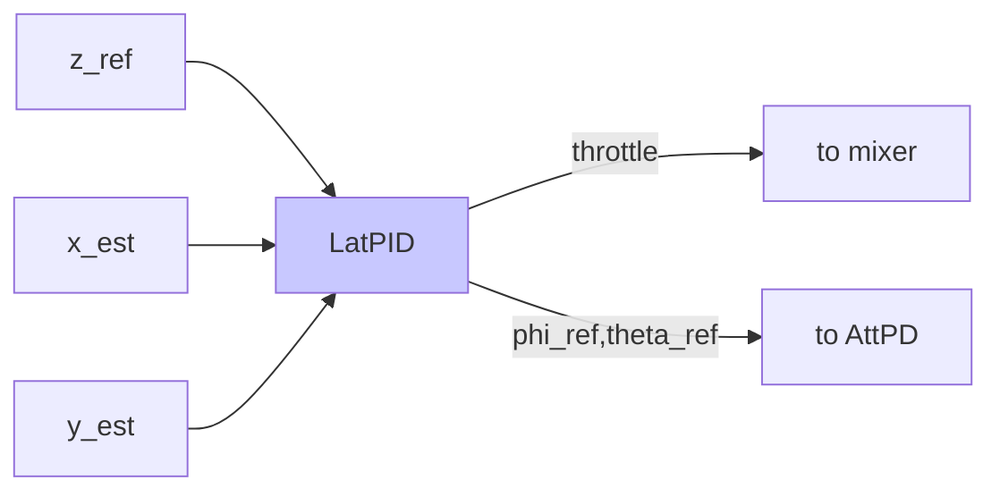

L'assemblage grandit — un `PositionSensor3D` fournit maintenant la position XY dans le repère mondial au contrôleur latéral :

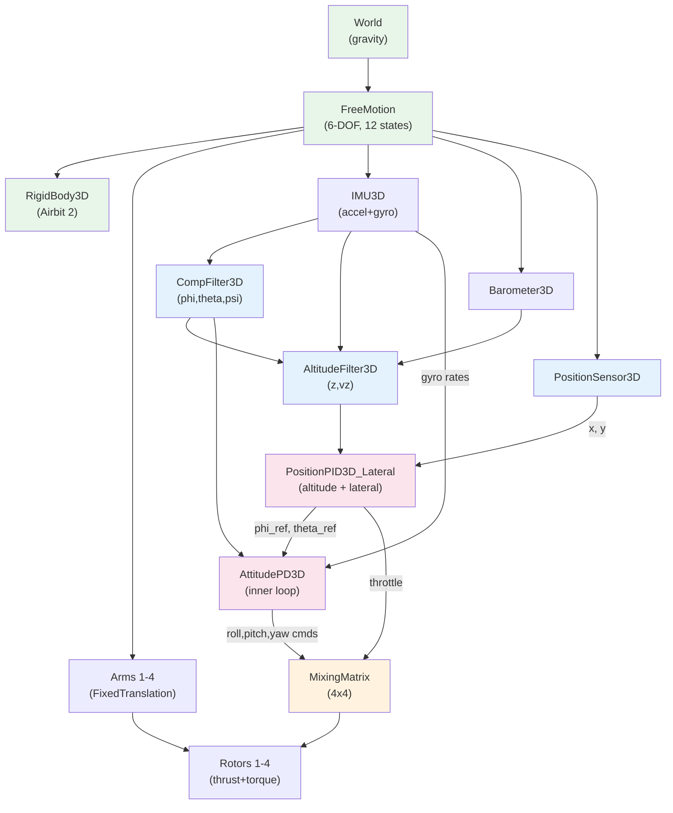

### Trajectoire carrée par points de passage

Le drone suit 4 points de passage formant un carré : $(0,0) \to (0.5, 0) \to (0.5, 0.5) \to (0, 0.5) \to (0, 0)$.


La limite d'inclinaison conservatrice signifie que le drone se déplace lentement mais maintient un excellent maintien d'altitude (à quelques centimètres près).

---

# Partie III : Combler l'écart avec la réalité

Nous avons volé avec des moteurs instantanés, sans vent, sans contact au sol et avec une batterie infinie. Le vrai Airbit 2 n'a aucun de ces luxes. Il est temps de combler l'écart.

---

## 11. Dynamique des moteurs : pourquoi le retard compte

Les vrais moteurs ne répondent pas instantanément. La poussée suit un retard du premier ordre :

$$\tau_m \frac{df}{dt} = f_{\text{cmd}} - f \qquad \tau_m = 30 \text{ ms}$$

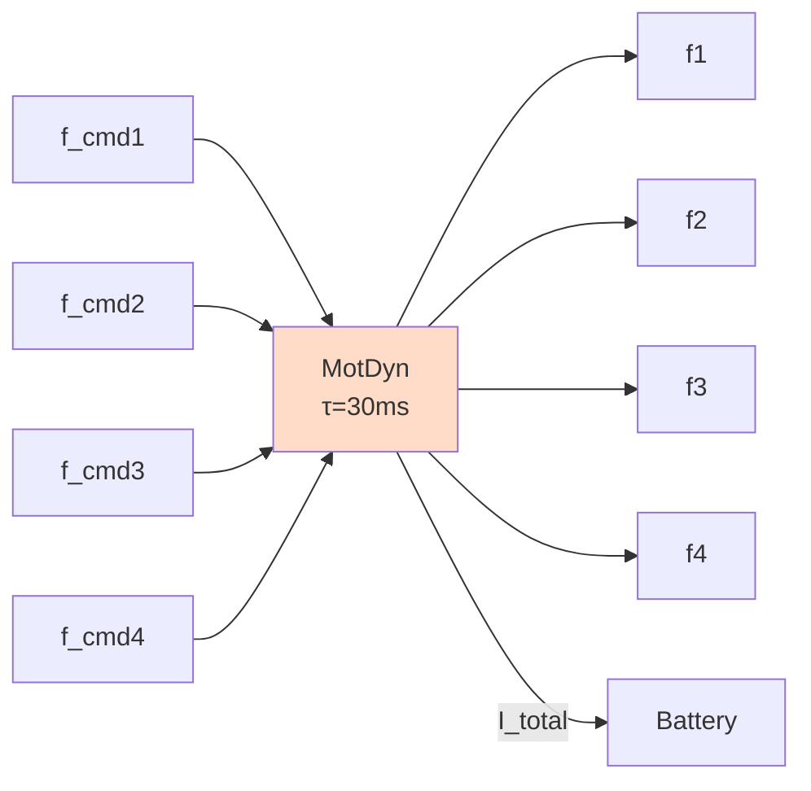

Avec des capteurs idéaux, un retard de 30ms est bénin — le système est bien plus lent que le moteur. Mais ajoutez du bruit aux capteurs et l'histoire change radicalement.

La fréquence propre du contrôleur d'attitude ($\omega_n \approx 112$ rad/s avec $K_p = 0.5$) **dépasse la bande passante du moteur** ($1/\tau_m = 33$ rad/s). Le moteur ne peut pas suivre, introduit un déphasage, et le retour bruité crée une boucle de rétroaction positive.

Résultat : **divergence par basculement en moins de 1.5 secondes**.


**La solution** : réduire les gains d'attitude d'un facteur 5 ($K_p : 0.5 \to 0.1$) pour que la bande passante du contrôleur reste en dessous de celle du moteur. C'est la découverte la plus importante de la simulation — et elle aurait été découverte de la manière forte (crash) sur le matériel réel.


L'assemblage route maintenant la sortie du mixeur à travers la dynamique moteur avant d'atteindre les rotors :

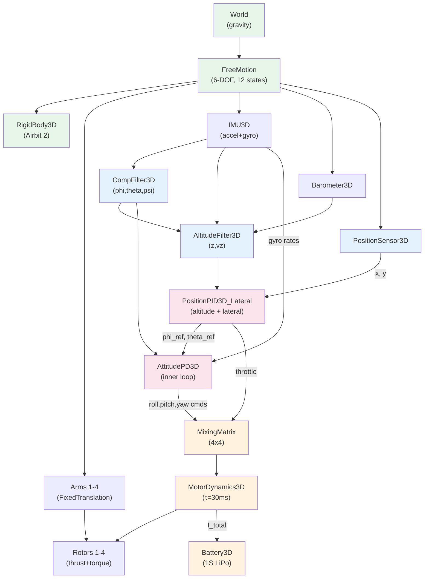

---

## 12. Environnement : vent, sol et batterie

Trois composants comblent le reste de l'écart avec la réalité.

### Perturbation par le vent

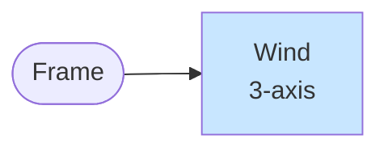

Un courant descendant de 0.3N (28% du poids du drone) frappe à $t = 10$ s pendant 5 secondes. Le contrôleur PID détecte la perte d'altitude et augmente la poussée pour compenser :


L'altitude chute d'environ 13.5 cm et se rétablit dans les 5 secondes après l'arrêt du vent. L'action intégrale du PID est ce qui permet le retour complet à l'altitude cible.

### Contact au sol

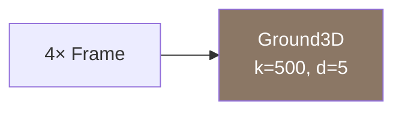

Le sol est modélisé comme 4 points de contact ressort-amortisseur (un par pied d'atterrissage) :

$$F_{z,i} = \begin{cases} -k_g z_i - d_g \dot{z}_i & \text{if } z_i < 0 \\ 0 & \text{otherwise} \end{cases}$$

avec $k_g = 500$ N/m, $d_g = 5$ N-s/m. Cela permet à la simulation de gérer les scénarios de décollage, d'atterrissage et de départ au sol.


### Décharge de batterie

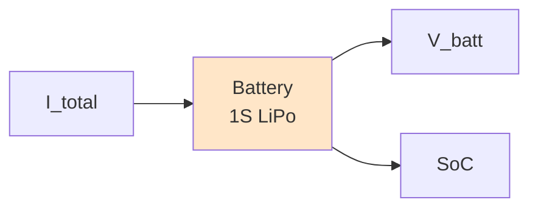

Le modèle de batterie suit l'état de charge par comptage de Coulombs :

$$\frac{d(\text{SoC})}{dt} = -\frac{I_{\text{draw}}}{C_{\text{nom}} \times 3600}$$

$$V_{\text{batt}} = V_{\text{oc}}({\text{SoC}}) - R_{\text{int}} \cdot I_{\text{draw}}$$

En vol stationnaire, le courant total est d'environ 0.4A, la tension chute de 4.2V à environ 4.13V, et le temps de vol estimé est d'environ 120 minutes (avec la batterie de 800 mAh).


---

## 13. Pousser les limites : manœuvre brusque

Poussons maintenant le drone plus fort. Une trajectoire carrée agressive de 1 mètre avec des changements de direction brusques à 90 degrés toutes les 3 secondes :

$(0,0) \to (1,0) \to (1,1) \to (0,1) \to (0,0)$

Les gains latéraux sont doublés ($K_p^x = 1.0$) et la limite d'inclinaison relevée à 25 degrés. À chaque transition de point de passage, le drone doit simultanément décélérer sur un axe et accélérer sur l'autre — exigeant l'autorité moteur maximale.


Pendant les virages à 90 degrés, les forces moteurs atteignent la saturation (0.363 N) car la matrice de mixage essaie de maintenir l'altitude tout en commandant une inclinaison agressive. La marge de 35% de poussée au-dessus du vol stationnaire est consommée par l'inclinaison soutenue de 25 degrés, qui réduit la poussée verticale de $1 - \cos(25°) = 9.4\%$.

C'est là que le TWR = 1.35 compte le plus : avec seulement 26% de marge, le drone peut à peine maintenir son altitude pendant un mouvement latéral agressif. Un drone plus lourd ou des moteurs plus faibles causeraient un crash.

---

## Points clés à retenir

1. **La MSL de Modelica élimine les équations de Newton-Euler manuelles** : `MultiBody.Parts.Body` + `FreeMotion` donne la dynamique à 6 DOF gratuitement. Pas de bugs de matrice de rotation.

2. **Connecteurs acausaux = plug-and-play** : remplacer le PD par un PID, ajouter un retard moteur, ajouter une batterie — chacun est un bloc indépendant. Le compilateur résout les mathématiques.

3. **Le retard moteur est le tueur silencieux** : un retard de 30ms est invisible en conditions idéales mais déstabilise la boucle d'attitude avec des capteurs bruités. La simulation l'a détecté ; le matériel réel se serait crashé.

4. **L'accéléromètre ne voit pas l'inclinaison en vol** : la poussée le long de l'axe Z du corps annule le signal de gravité. Le filtre complémentaire s'appuie uniquement sur le gyroscope pour le suivi de l'inclinaison — expliquant pourquoi les vrais drones dérivent.

5. **TWR = 1.35 limite tout** : avec seulement 26% de marge de poussée au-dessus du vol stationnaire, le drone ne peut pas faire de manœuvres agressives. Chaque gain de contrôleur doit respecter cette contrainte.

6. **La simulation correspond exactement au firmware** : la matrice de mixage, les gains du filtre complémentaire et les paramètres de bruit des capteurs sont tous tirés directement du code source du Airbit 2 et de la fiche technique du MPU6050.

---

*Construit avec [OpenModelica](https://openmodelica.org/) v1.26.3. Tout le code source, les modèles et les animations se trouvent dans le dépôt [`drone`](.).*
