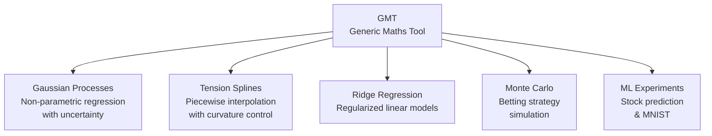
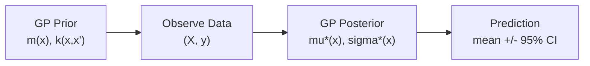
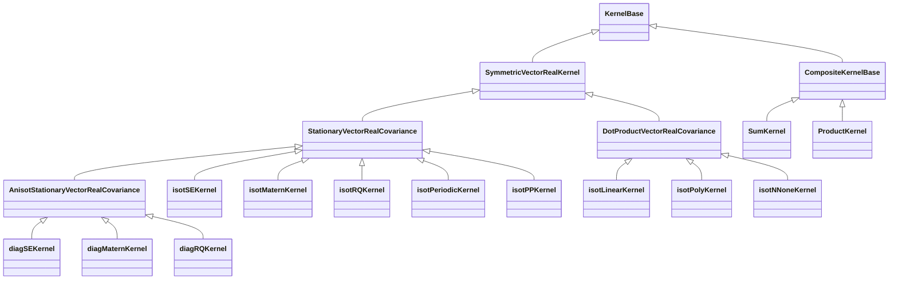
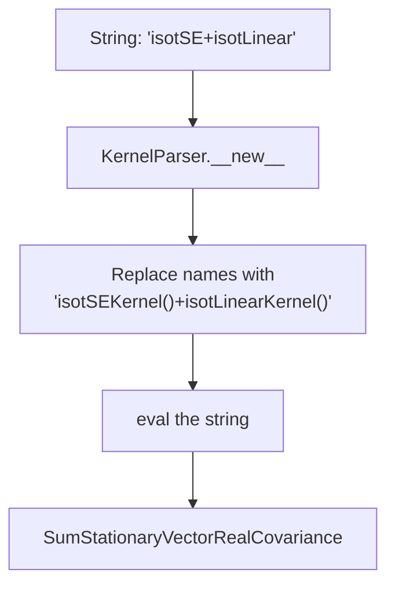
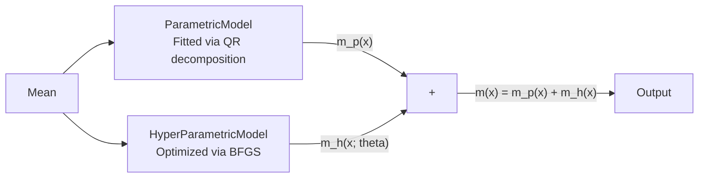
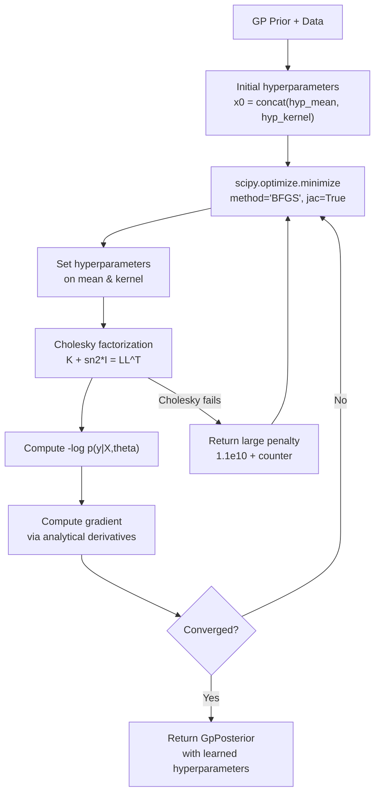
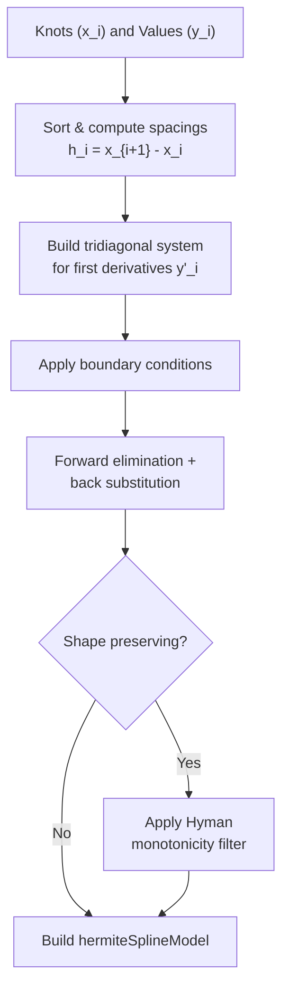
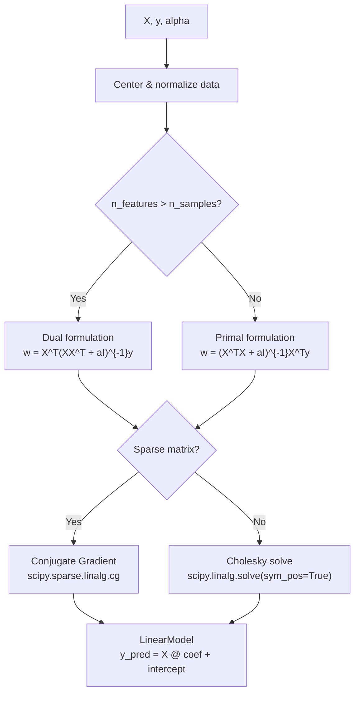
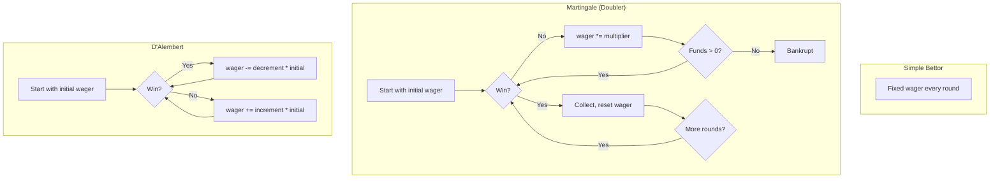
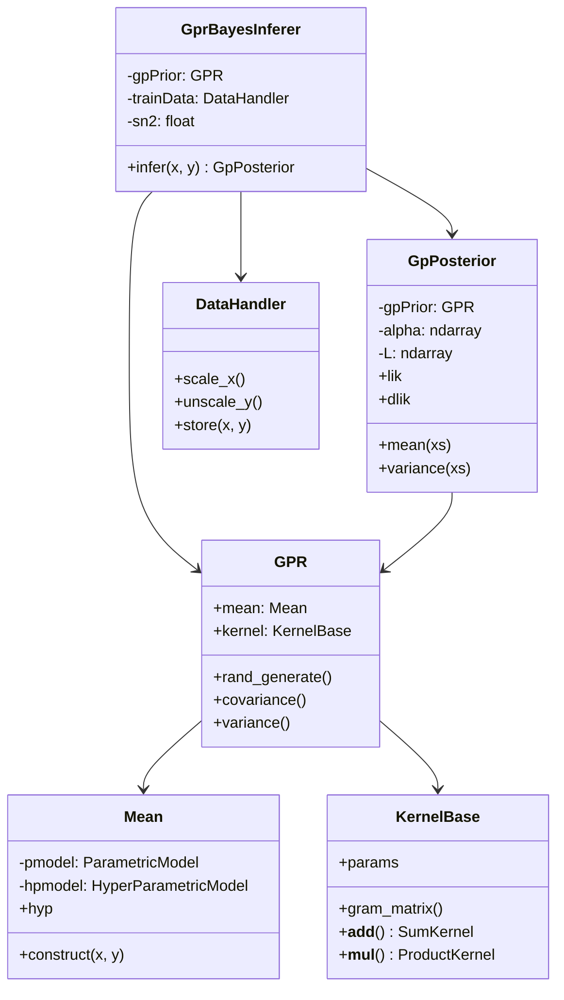

A technical walkthrough of the mathematical tools implemented in the GMT (Generic Maths Tool) library — covering Gaussian process regression, tension splines, ridge regression, Monte Carlo simulation, and neural networks.

---

## 1. Overview

GMT is a Python scientific computing library implementing several families of approximation and simulation methods. Each module addresses a distinct mathematical problem:



---

## 2. Gaussian Process Regression

The largest and most developed module. It implements a full Bayesian GP regression pipeline: kernels, mean functions, marginal likelihood optimization, and posterior prediction with confidence intervals.

### 2.1 What is a Gaussian Process?

A Gaussian process is a collection of random variables, any finite subset of which has a joint Gaussian distribution. A GP is fully specified by a mean function $m(x)$ and covariance (kernel) function $k(x, x')$:

$$f(x) \sim \mathcal{GP}\big(m(x),\; k(x, x')\big)$$

In code, a GP prior is constructed via the `GPR` class:

```python
prior = GPR(
    regressor="Zero",       # parametric mean
    hypmodel="Linear",      # hyperparametric mean
    hypMean=[0., 1.],
    kernel="isotSE",        # kernel string parsed by KernelParser
)
```

The GP regression pipeline:



### 2.2 Covariance Kernels

A kernel is a positive semi-definite function that measures similarity between inputs. All kernels inherit from `KernelBase` and implement `_eval` or `_eval_dx` for evaluation and analytical derivatives. Hyperparameters are stored in log-space (`np.exp(self.params[0])`) for unconstrained optimization.

#### Kernel Class Hierarchy



#### Stationary Kernels

Stationary kernels depend only on the difference $\Delta x = x_1 - x_2$. They implement `_eval_dx(dx, i)` where `i=0` returns the kernel value and `i>=1` returns the derivative w.r.t. the `i`-th hyperparameter.

**Squared Exponential (SE)**

The smoothest kernel (infinitely differentiable). One length-scale parameter $l$.

$$k(\Delta x) = \exp\!\left(-\frac{\|\Delta x\|^2}{2l^2}\right)$$

```python
def _eval_dx(self, dx, i=0):
    l = np.exp(self.params[0])
    sq_dist = np.sum(dx ** 2, axis=1) / (l**2)
    if i == 0:
        return np.exp(-sq_dist / 2.0)
    elif i == 1:
        return np.exp(-sq_dist / 2.0) * sq_dist  # dk/d(log l)
```

The **anisotropic** variant `diagSEKernel` uses one length-scale per input dimension (Automatic Relevance Determination).

**Matern**

A family of kernels parameterized by smoothness order $\nu \in \{1, 3, 5\}$:

$$\nu=1: \quad k(r) = e^{-r}$$

$$\nu=3: \quad k(r) = (1+r)\,e^{-r}$$

$$\nu=5: \quad k(r) = \left(1 + r + \frac{r^2}{3}\right) e^{-r}$$

where $r = \|\Delta x\| / l$. Lower $\nu$ produces rougher functions; $\nu \to \infty$ recovers the SE kernel.

```python
def _eval_dx(self, dx, i=0):
    l = np.exp(self.params[0])
    dist = np.sqrt(np.sum((np.abs(dx) / l)**2, axis=1))
    if self.extra_params[0] == 3:
        f = (1.0 + dist)
        df = dist
    if i == 0:
        return f * np.exp(-dist)
    elif i == 1:
        return df * dist * np.exp(-dist)  # dk/d(log l)
```

**Rational Quadratic (RQ)**

Equivalent to an infinite mixture of SE kernels with different length-scales. Two parameters: $l$ and $\alpha$.

$$k(r) = \left(1 + \frac{r^2}{2\alpha}\right)^{-\alpha}$$

As $\alpha \to \infty$, the RQ kernel recovers the SE kernel.

**Periodic**

Models periodic functions. Two parameters: length-scale $l$ and period $p$.

$$k(r) = \exp\!\left(-\frac{2\sin^2(\pi r / p)}{l^2}\right)$$

**Piecewise Polynomial (PP)**

A compactly supported kernel that produces sparse covariance matrices:

$$k(r) = \max(1-r,\; 0)^{j+\nu} \cdot f(r,\, j)$$

where $f$ is a polynomial whose degree controls smoothness.

#### Dot-Product Kernels

These kernels depend on the inner product $x_1 \cdot x_2$ rather than their difference. They produce non-stationary functions.

**Linear**: $k(x_1, x_2) = x_1^\top x_2 / l^2$

**Polynomial**: $k(x_1, x_2) = (x_1^\top x_2 + c)^d$

**Neural Network**

The arc-sine kernel, equivalent to a single-hidden-layer neural network with infinite width (Neal 1996):

$$k(x_1, x_2) = \arcsin\!\left(\frac{1 + x_1^\top x_2}{\sqrt{(l^2 + 1 + \|x_1\|^2)(l^2 + 1 + \|x_2\|^2)}}\right)$$

```python
def _eval(self, x1, x2, identical=False, i=0):
    l2 = np.exp(2.0 * self._params[0])
    if i == 0:
        S   = 1.0 + np.sum(x1 * x2, axis=1)
        sx1 = 1.0 + np.sum(x1**2, axis=1)
        sx2 = 1.0 + np.sum(x2**2, axis=1)
        K = S / (np.sqrt(l2 + sx1) * np.sqrt(l2 + sx2))
        return np.arcsin(K)
```

#### Brownian Motion Kernels

Special non-stationary kernels for stochastic processes:

- **`isot0fBKernel`**: Wiener process pinned at 0 — $k(x_1, x_2) = \sigma^2 \min(|x_1|, |x_2|)$
- **`isot01fBKernel`**: Brownian bridge — $k(x_1, x_2) = \sigma^2 (\min(|x_1|, |x_2|) - x_1 x_2)$

#### Composite Kernels

Kernels can be combined via `+` and `*` operators thanks to Python's `__add__` and `__mul__` overloading in `KernelBase`:

```python
def __add__(self, k_rhs):
    return SumKernel(self, k_rhs)

def __mul__(self, k_rhs):
    return ProductKernel(self, k_rhs)
```

The `SumKernel` evaluates as $k_{sum}(x_1,x_2) = k_1(x_1,x_2) + k_2(x_1,x_2)$. Derivatives route to the correct sub-kernel via `IndexMixer` for seamless hyperparameter management.

The `ProductKernel` applies the product rule for derivatives: $\frac{\partial (k_1 \cdot k_2)}{\partial \theta_i} = \frac{\partial k_i}{\partial \theta_i} \cdot k_{other}$.

#### KernelParser Factory

Kernels are instantiated from strings via `KernelParser`:



#### The Gram Matrix

The Gram matrix is the core data structure — an $n \times n$ symmetric matrix where $K_{ij} = k(x_i, x_j)$. For stationary kernels, it is computed efficiently:

1. Compute pairwise L1 cross-distances via `l1_cross_distances(X)`
2. Evaluate kernel on all distances: `r = _eval_dx(dx, i=i)`
3. Fill symmetric matrix: `R[ij[:,0], ij[:,1]] = r; R[ij[:,1], ij[:,0]] = r`

```python
def gram_matrix(self, x1, x2=None, i=0):
    if x2 is None:
        dx, ij = self.l1_cross_distances(x1)
        r = self._eval_dx(dx, i=i)
        R = np.eye(len(x1))
        R[ij[:, 0], ij[:, 1]] = r
        R[ij[:, 1], ij[:, 0]] = r
        return R
```

### 2.3 Mean Functions

The mean function $m(x)$ has two components:



**Parametric models** are fitted to data via QR decomposition of the regression matrix $F$:

| Model | Basis function $f(x)$ |
|-------|-----------------------|
| Zero | $0$ |
| Constant | $[1]$ |
| Linear | $[1, x_1, \dots, x_d]$ |
| Identity | $[x_1, \dots, x_d]$ |
| Quadratic | $[1, x_i, x_i x_j]$ |

```python
Q, R = linalg.qr(F, mode='economic')
self.__param = linalg.solve_triangular(R, np.dot(Q.T, y))
```

**Hyperparametric models** have learnable hyperparameters $\theta$ optimized during inference. They provide analytical derivatives $\partial m / \partial \theta_i$ needed for gradient-based optimization.

### 2.4 Bayesian Inference

`GprBayesInferer` learns optimal hyperparameters by maximizing the marginal likelihood — a principled Bayesian approach that automatically balances model fit and complexity.

#### Marginal Log-Likelihood

The negative log marginal likelihood (the objective to minimize):

$$\mathcal{L} = \underbrace{\frac{1}{2}(y - m)^\top (K + \sigma_n^2 I)^{-1}(y - m)}_{\text{data fit}} + \underbrace{\frac{1}{2}\log|K + \sigma_n^2 I|}_{\text{complexity penalty}} + \frac{n}{2}\log(2\pi)$$

Computed via Cholesky decomposition for numerical stability:

```python
K = self.__gpPrior.covariance(self.__trainData.x)
m = self.__gpPrior.mean(self.__trainData.x)
L, lower = linalg.cho_factor(K + sn2 * np.eye(n), lower=False)
alpha = linalg.cho_solve((L, lower), y - m)
```

#### Gradient of Log-Likelihood

$$\frac{\partial \mathcal{L}}{\partial \theta_k} = \frac{1}{2}\,\text{tr}\!\left((\alpha\alpha^\top - K^{-1})\frac{\partial K}{\partial \theta_k}\right)$$

The code avoids explicit matrix inversion using the Cholesky factor:

```python
Q = linalg.cho_solve((L, lower), np.eye(n))  # K^{-1}
Qaux = Q - np.dot(alpha, alpha.T)

for k in range(nhypCov):
    dcov = self.__gpPrior.covariance(x=self.__trainData.x, i=k+1)
    res[k] = 0.5 * np.sum(np.sum(Qaux * dcov, axis=0), axis=0)
```

#### Optimization Loop



If the Cholesky factorization fails (matrix not positive definite for certain hyperparameter values), the code returns a large penalty to steer the optimizer away.

### 2.5 Posterior Prediction

Given a trained `GpPosterior`, predictions at new points $x^*$ are:

**Predictive mean:**

$$\mu^*(x^*) = m(x^*) + k(X, x^*)^\top \alpha$$

**Predictive variance:**

$$\sigma^{*2}(x^*) = k(x^*, x^*) - v^\top v, \quad v = L^{-\top} k(X, x^*)$$

```python
# Predictive mean (batch processing)
ms = self.__gpPrior.mean(x[idi, :])
ks = self.__gpPrior.covariance(self.__trainData.x, x[idi, :])
ymu[idi, :] = ms + np.dot(ks, self.__alpha)
```

```python
# Predictive variance
kss = self.__gpPrior.variance(x[idi, :])
ks = self.__gpPrior.covariance(self.__trainData.x, x[idi, :])
v = linalg.solve_triangular(L.T, ks.T, lower=not self.__lower)
ys2[idi, :] = kss - (v**2).sum(axis=0).reshape(len(idi), dout)
```

Both methods process in batches for memory efficiency and unscale predictions back to original data space via `DataHandler`.

### 2.6 Sampling Random Functions

Random functions are drawn from either the prior or posterior by Cholesky sampling:

$$y = L \cdot z + m(x), \quad z \sim \mathcal{N}(0, I)$$

where $L$ is the Cholesky factor of the covariance matrix $K + \sigma_n^2 I$.

```python
K = self.covariance(x)
L, _ = linalg.cho_factor(K + sn2 * np.eye(n_sample), lower=True)
xx = np.random.randn(n_sample, 1)
y = np.dot(L, xx) + m
```

For posterior sampling, the covariance is replaced by the posterior covariance: $K_{post} = K_{**} - K_*^\top (K + \sigma_n^2 I)^{-1} K_*$.

### 2.7 Data Scaling

`DataHandler` manages input/output preprocessing. Scaling is critical because kernel length-scales are relative — unscaled data with different magnitudes per dimension would require extreme hyperparameter values.

| Scaler | Formula |
|--------|---------|
| Normalize | $(x - \mu) / \sigma$ |
| Uniformize | $(x - x_{min}) / (x_{max} - x_{min})$ |
| Center | $x - \mu$ |
| Reduce | $x / \sigma$ |
| Identitize | $x$ (no-op) |

Each can be applied independently to X and Y. The handler stores both original and scaled data, and provides `scale_x()` and `unscale_y()` for new predictions.

### 2.8 Stochastic Differential Equations

The codebase includes SDE integration using the Euler-Maruyama method, leveraging the Brownian motion kernel:

$$dX = \mu(t, X)\,dt + \sigma(t, X)\,dB_t$$

For geometric Brownian motion ($dX = \mu X\,dt + \sigma X\,dB_t$), the closed-form solution is:

$$X(t) = X_0 \exp\!\left(\sigma B_t + \left(\mu - \frac{\sigma^2}{2}\right)t\right)$$

```python
Bt = np.sqrt(dt) * np.random.normal(size=(n_steps+1, 1))
Bt = np.cumsum(Bt, axis=0)

for i in range(n_steps):
    Xi, t = X[i, p], ts[i]
    dX = mu(t, Xi) * dt + sigma(t, Xi) * (Bt[i+1] - Bt[i])
    X[i+1, p] = Xi + dX
```

The analytical solution is compared against Monte Carlo paths to validate convergence.

---

## 3. Tension Splines

The spline module implements tension splines — a generalization of cubic splines where a tension parameter $\sigma$ controls the trade-off between smoothness and tautness.

### The Tension Parameter

$$\sigma = 0 \implies \text{Cubic spline (smoothest)}$$
$$\sigma \to \infty \implies \text{Piecewise linear (tautest)}$$

### Hermite Spline Evaluation

The `hermiteSplineModel` class evaluates the spline in three numerical regimes based on the magnitude of $\sigma$:

| Regime | Condition | Method |
|--------|-----------|--------|
| Zero tension | $\sigma \leq \varepsilon$ | Cubic polynomial |
| Moderate tension | $\varepsilon < \sigma \leq 0.5$ | Hyperbolic trig (sinh/cosh) |
| High tension | $\sigma > 0.5$ | Exponential with overflow protection |

The three-regime approach avoids catastrophic cancellation. The `hyperbolicTrigApproxer` class uses Pade-like rational polynomial approximations for $\sinh(x) - x$ and $\cosh(x) - 1$ when $|x| \leq 0.5$.

### Spline Construction



The `tensionSplineBuilder1D` solves a tridiagonal linear system to find the first derivatives $y'_i$ at each knot, subject to $C^2$ continuity constraints. **Boundary conditions** supported:

- **Natural**: $y''(x_0) = 0$, $y''(x_n) = 0$
- **Clamped**: $y'(x_0) = c_0$, $y'(x_n) = c_n$ (user-specified slopes)
- **Periodic**: $y(x_0) = y(x_n)$, $y'(x_0) = y'(x_n)$, $y''(x_0) = y''(x_n)$
- **Parabolic**: constant second derivative near endpoints

### Shape Preservation

The **Hyman monotonicity filter** modifies computed slopes to ensure the interpolation is monotone wherever the data is monotone. In $C^2$ mode, tensions are iteratively increased until shape preservation is achieved.

```
sigma = 0:     ~~~~smooth curve~~~~     (may overshoot)
sigma > 0:     ___taut curve___         (monotonicity preserved)
sigma -> inf:  ---linear segments---    (no overshoot possible)
```

### Norm Computations

The model computes several norms for error analysis: $L_1$, $L_2$, and Sobolev norms $H^0$, $H^1$, $H^2$ — useful for measuring approximation quality.

---

## 4. Ridge Regression

Tikhonov-regularized least squares.

### The Ridge Problem

$$\hat{w} = \arg\min_w \|Xw - y\|^2 + \alpha \|w\|^2$$

Closed-form solution: $\hat{w} = (X^\top X + \alpha I)^{-1} X^\top y$

### Solver Selection

The code automatically selects between primal and dual formulations based on the problem shape:



The dual formulation is more efficient when $d \gg n$ (high-dimensional, few samples), since it inverts an $n \times n$ matrix instead of $d \times d$.

### Key Implementation Details

- **Data preprocessing**: `center_data()` mean-centers features and optionally L2-normalizes them
- **Sparse support**: `safe_sparse_dot()` handles both dense `np.ndarray` and `scipy.sparse` matrices
- **Intercept recovery**: $b = \bar{y} - \bar{X} \cdot w / s$ where $s$ is the feature scaling
- **OLS special case**: `OlrBuilder` implements ordinary least squares ($\alpha = 0$) via the same framework

---

## 5. Monte Carlo Betting Strategies

Simulation and analysis of three betting strategies against a house-edge game (49% win, 51% lose).

### Strategies



**Martingale** doubles the wager after each loss, risking exponential ruin. **D'Alembert** is more conservative — linear wager adjustment instead of geometric.

### Metrics

$$\text{Death rate} = \frac{\text{broke count}}{\text{sample size}} \times 100\%$$

$$\text{ROI} = \frac{\text{total return} - \text{total invested}}{\text{total invested}} \times 100\%$$

Results are visualized as 3D scatter plots (wager size vs. wager count vs. ROI).

---

## 6. ML Experiments

### Stock Price Prediction

Linear regression on Google stock data:

- **Features**: High-Low % volatility, Open-Close % change, Adj. Volume
- **Target**: Adjusted Close price shifted forward by `forecast_out` periods
- **Model**: `sklearn.linear_model.LinearRegression`

### MNIST Classification

A 3-hidden-layer neural network using TensorFlow:

```
Input (784) --> Dense(500, ReLU) --> Dense(500, ReLU) --> Dense(500, ReLU) --> Dense(10, Softmax)
```

- **Optimizer**: Adam
- **Loss**: Softmax cross-entropy with logits
- **Batch size**: 100, **Epochs**: 20

---

## 7. Software Architecture

### Module Relationships



### Design Patterns

| Pattern | Where | Purpose |
|---------|-------|---------|
| **Abstract Base Class** | `KernelBase`, `GPBase` via `ABCMeta` | Enforce interface contracts for kernels and GP models |
| **Factory** | `KernelParser` | Instantiate kernels from string descriptions |
| **Composite** | `SumKernel`, `ProductKernel` | Compose arbitrary kernels with consistent parameter/derivative handling |
| **Strategy** | `DataHandler` scalers, ridge solver selection | Swap algorithms at runtime based on data properties |
| **Builder** | `RidgeBuilder`, `tensionSplineBuilder1D` | Step-by-step construction of complex models |

### Log-Space Parameterization

All kernel hyperparameters are stored in log-space. When the optimizer proposes $\theta$, the actual parameter is $e^\theta$. This ensures positivity and transforms a constrained optimization into an unconstrained one:

```python
l = np.exp(self.params[0])  # length-scale is always positive
```

### Derivative Indexing Convention

Throughout the codebase, the `i` parameter in `_eval_dx(dx, i)` and `covariance(x, i)` follows this convention:

- `i=0`: function value
- `i=1`: derivative w.r.t. first hyperparameter
- `i=2`: derivative w.r.t. second hyperparameter
- ...and so on

This allows the optimizer to request all necessary gradients through a uniform interface.
