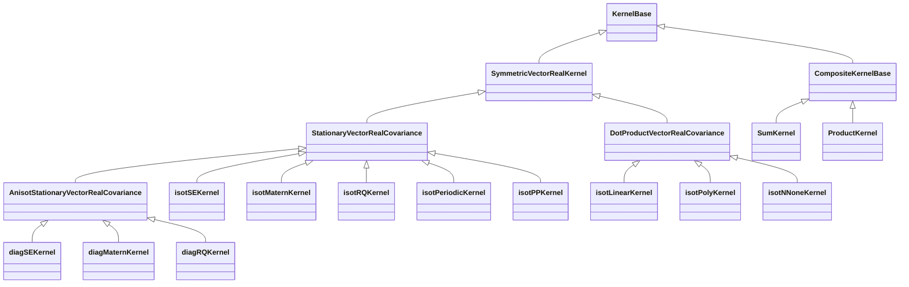

Presentation technique des outils mathematiques implementes dans la bibliotheque GMT (Generic Maths Tool) — couvrant la regression par processus gaussiens, les splines en tension, la regression ridge, la simulation Monte Carlo et les reseaux de neurones.

---

## 1. Vue d'ensemble

GMT est une bibliotheque Python de calcul scientifique implementant plusieurs familles de methodes d'approximation et de simulation. Chaque module traite un probleme mathematique distinct :


---

## 2. Regression par processus gaussiens

Le module le plus developpe. Il implemente un pipeline complet de regression GP bayesienne : noyaux, fonctions moyennes, optimisation de la vraisemblance marginale et prediction posterieure avec intervalles de confiance.

### 2.1 Qu'est-ce qu'un processus gaussien ?

Un processus gaussien est une collection de variables aleatoires dont tout sous-ensemble fini suit une distribution gaussienne jointe. Un GP est entierement specifie par une fonction moyenne $m(x)$ et une fonction de covariance (noyau) $k(x, x')$ :

$$f(x) \sim \mathcal{GP}\big(m(x),\; k(x, x')\big)$$

En code, un prior GP est construit via la classe `GPR` :

```python
prior = GPR(
    regressor="Zero",       # moyenne parametrique
    hypmodel="Linear",      # moyenne hyperparametrique
    hypMean=[0., 1.],
    kernel="isotSE",        # chaine noyau analysee par KernelParser
)
```

Le pipeline de regression GP :


### 2.2 Noyaux de covariance

Un noyau est une fonction semi-definie positive qui mesure la similarite entre entrees. Tous les noyaux heritent de `KernelBase` et implementent `_eval` ou `_eval_dx` pour l'evaluation et les derivees analytiques. Les hyperparametres sont stockes en espace logarithmique (`np.exp(self.params[0])`) pour une optimisation sans contrainte.

#### Hierarchie des classes de noyaux



#### Noyaux stationnaires

Les noyaux stationnaires ne dependent que de la difference $\Delta x = x_1 - x_2$. Ils implementent `_eval_dx(dx, i)` ou `i=0` retourne la valeur du noyau et `i>=1` retourne la derivee par rapport au `i`-eme hyperparametre.

**Exponentielle carree (SE)**

Le noyau le plus lisse (infiniment differentiable). Un parametre d'echelle $l$.

$$k(\Delta x) = \exp\!\left(-\frac{\|\Delta x\|^2}{2l^2}\right)$$

```python
def _eval_dx(self, dx, i=0):
    l = np.exp(self.params[0])
    sq_dist = np.sum(dx ** 2, axis=1) / (l**2)
    if i == 0:
        return np.exp(-sq_dist / 2.0)
    elif i == 1:
        return np.exp(-sq_dist / 2.0) * sq_dist  # dk/d(log l)
```

La variante **anisotrope** `diagSEKernel` utilise une echelle par dimension d'entree (Automatic Relevance Determination).

**Matern**

Une famille de noyaux parametree par l'ordre de regularite $\nu \in \{1, 3, 5\}$ :

$$\nu=1: \quad k(r) = e^{-r}$$

$$\nu=3: \quad k(r) = (1+r)\,e^{-r}$$

$$\nu=5: \quad k(r) = \left(1 + r + \frac{r^2}{3}\right) e^{-r}$$

ou $r = \|\Delta x\| / l$. Un $\nu$ faible produit des fonctions plus rugueuses ; $\nu \to \infty$ retrouve le noyau SE.

```python
def _eval_dx(self, dx, i=0):
    l = np.exp(self.params[0])
    dist = np.sqrt(np.sum((np.abs(dx) / l)**2, axis=1))
    if self.extra_params[0] == 3:
        f = (1.0 + dist)
        df = dist
    if i == 0:
        return f * np.exp(-dist)
    elif i == 1:
        return df * dist * np.exp(-dist)  # dk/d(log l)
```

**Quadratique rationnel (RQ)**

Equivalent a un melange infini de noyaux SE avec differentes echelles. Deux parametres : $l$ et $\alpha$.

$$k(r) = \left(1 + \frac{r^2}{2\alpha}\right)^{-\alpha}$$

Quand $\alpha \to \infty$, le noyau RQ retrouve le noyau SE.

**Periodique**

Modelise des fonctions periodiques. Deux parametres : echelle $l$ et periode $p$.

$$k(r) = \exp\!\left(-\frac{2\sin^2(\pi r / p)}{l^2}\right)$$

**Polynome par morceaux (PP)**

Un noyau a support compact qui produit des matrices de covariance creuses :

$$k(r) = \max(1-r,\; 0)^{j+\nu} \cdot f(r,\, j)$$

ou $f$ est un polynome dont le degre controle la regularite.

#### Noyaux a produit scalaire

Ces noyaux dependent du produit scalaire $x_1 \cdot x_2$ plutot que de leur difference. Ils produisent des fonctions non-stationnaires.

**Lineaire** : $k(x_1, x_2) = x_1^\top x_2 / l^2$

**Polynomial** : $k(x_1, x_2) = (x_1^\top x_2 + c)^d$

**Reseau de neurones**

Le noyau arc-sinus, equivalent a un reseau de neurones a une couche cachee de largeur infinie (Neal 1996) :

$$k(x_1, x_2) = \arcsin\!\left(\frac{1 + x_1^\top x_2}{\sqrt{(l^2 + 1 + \|x_1\|^2)(l^2 + 1 + \|x_2\|^2)}}\right)$$

```python
def _eval(self, x1, x2, identical=False, i=0):
    l2 = np.exp(2.0 * self._params[0])
    if i == 0:
        S   = 1.0 + np.sum(x1 * x2, axis=1)
        sx1 = 1.0 + np.sum(x1**2, axis=1)
        sx2 = 1.0 + np.sum(x2**2, axis=1)
        K = S / (np.sqrt(l2 + sx1) * np.sqrt(l2 + sx2))
        return np.arcsin(K)
```

#### Noyaux de mouvement brownien

Noyaux non-stationnaires speciaux pour les processus stochastiques :

- **`isot0fBKernel`** : processus de Wiener ancre en 0 — $k(x_1, x_2) = \sigma^2 \min(|x_1|, |x_2|)$
- **`isot01fBKernel`** : pont brownien — $k(x_1, x_2) = \sigma^2 (\min(|x_1|, |x_2|) - x_1 x_2)$

#### Noyaux composites

Les noyaux peuvent etre combines via les operateurs `+` et `*` grace a la surcharge `__add__` et `__mul__` de Python dans `KernelBase` :

```python
def __add__(self, k_rhs):
    return SumKernel(self, k_rhs)

def __mul__(self, k_rhs):
    return ProductKernel(self, k_rhs)
```

Le `SumKernel` evalue comme $k_{sum}(x_1,x_2) = k_1(x_1,x_2) + k_2(x_1,x_2)$. Les derivees sont dirigees vers le bon sous-noyau via `IndexMixer` pour une gestion transparente des hyperparametres.

Le `ProductKernel` applique la regle du produit pour les derivees : $\frac{\partial (k_1 \cdot k_2)}{\partial \theta_i} = \frac{\partial k_i}{\partial \theta_i} \cdot k_{other}$.

#### Fabrique KernelParser

Les noyaux sont instancies a partir de chaines via `KernelParser` :


#### La matrice de Gram

La matrice de Gram est la structure de donnees centrale — une matrice symetrique $n \times n$ ou $K_{ij} = k(x_i, x_j)$. Pour les noyaux stationnaires, elle est calculee efficacement :

1. Calculer les distances croisees L1 par paires via `l1_cross_distances(X)`
2. Evaluer le noyau sur toutes les distances : `r = _eval_dx(dx, i=i)`
3. Remplir la matrice symetrique : `R[ij[:,0], ij[:,1]] = r; R[ij[:,1], ij[:,0]] = r`

```python
def gram_matrix(self, x1, x2=None, i=0):
    if x2 is None:
        dx, ij = self.l1_cross_distances(x1)
        r = self._eval_dx(dx, i=i)
        R = np.eye(len(x1))
        R[ij[:, 0], ij[:, 1]] = r
        R[ij[:, 1], ij[:, 0]] = r
        return R
```

### 2.3 Fonctions moyennes

La fonction moyenne $m(x)$ a deux composantes :


Les **modeles parametriques** sont ajustes aux donnees par decomposition QR de la matrice de regression $F$ :

| Modele | Fonction de base $f(x)$ |
|--------|-------------------------|
| Zero | $0$ |
| Constant | $[1]$ |
| Lineaire | $[1, x_1, \dots, x_d]$ |
| Identite | $[x_1, \dots, x_d]$ |
| Quadratique | $[1, x_i, x_i x_j]$ |

```python
Q, R = linalg.qr(F, mode='economic')
self.__param = linalg.solve_triangular(R, np.dot(Q.T, y))
```

Les **modeles hyperparametriques** ont des hyperparametres apprenables $\theta$ optimises pendant l'inference. Ils fournissent les derivees analytiques $\partial m / \partial \theta_i$ necessaires a l'optimisation par gradient.

### 2.4 Inference bayesienne

`GprBayesInferer` apprend les hyperparametres optimaux en maximisant la vraisemblance marginale — une approche bayesienne principielle qui equilibre automatiquement ajustement aux donnees et complexite.

#### Log-vraisemblance marginale

La log-vraisemblance marginale negative (l'objectif a minimiser) :

$$\mathcal{L} = \underbrace{\frac{1}{2}(y - m)^\top (K + \sigma_n^2 I)^{-1}(y - m)}_{\text{ajustement}} + \underbrace{\frac{1}{2}\log|K + \sigma_n^2 I|}_{\text{penalite de complexite}} + \frac{n}{2}\log(2\pi)$$

Calculee via decomposition de Cholesky pour la stabilite numerique :

```python
K = self.__gpPrior.covariance(self.__trainData.x)
m = self.__gpPrior.mean(self.__trainData.x)
L, lower = linalg.cho_factor(K + sn2 * np.eye(n), lower=False)
alpha = linalg.cho_solve((L, lower), y - m)
```

#### Gradient de la log-vraisemblance

$$\frac{\partial \mathcal{L}}{\partial \theta_k} = \frac{1}{2}\,\text{tr}\!\left((\alpha\alpha^\top - K^{-1})\frac{\partial K}{\partial \theta_k}\right)$$

Le code evite l'inversion matricielle explicite en utilisant le facteur de Cholesky :

```python
Q = linalg.cho_solve((L, lower), np.eye(n))  # K^{-1}
Qaux = Q - np.dot(alpha, alpha.T)

for k in range(nhypCov):
    dcov = self.__gpPrior.covariance(x=self.__trainData.x, i=k+1)
    res[k] = 0.5 * np.sum(np.sum(Qaux * dcov, axis=0), axis=0)
```

#### Boucle d'optimisation


Si la factorisation de Cholesky echoue (matrice non definie positive pour certaines valeurs d'hyperparametres), le code retourne une grande penalite pour eloigner l'optimiseur.

### 2.5 Prediction posterieure

Etant donne un `GpPosterior` entraine, les predictions aux nouveaux points $x^*$ sont :

**Moyenne predictive :**

$$\mu^*(x^*) = m(x^*) + k(X, x^*)^\top \alpha$$

**Variance predictive :**

$$\sigma^{*2}(x^*) = k(x^*, x^*) - v^\top v, \quad v = L^{-\top} k(X, x^*)$$

```python
# Moyenne predictive (traitement par lots)
ms = self.__gpPrior.mean(x[idi, :])
ks = self.__gpPrior.covariance(self.__trainData.x, x[idi, :])
ymu[idi, :] = ms + np.dot(ks, self.__alpha)
```

```python
# Variance predictive
kss = self.__gpPrior.variance(x[idi, :])
ks = self.__gpPrior.covariance(self.__trainData.x, x[idi, :])
v = linalg.solve_triangular(L.T, ks.T, lower=not self.__lower)
ys2[idi, :] = kss - (v**2).sum(axis=0).reshape(len(idi), dout)
```

Les deux methodes traitent par lots pour l'efficacite memoire et remettent les predictions a l'echelle originale via `DataHandler`.

### 2.6 Echantillonnage de fonctions aleatoires

Les fonctions aleatoires sont tirees du prior ou du posterieur par echantillonnage de Cholesky :

$$y = L \cdot z + m(x), \quad z \sim \mathcal{N}(0, I)$$

ou $L$ est le facteur de Cholesky de la matrice de covariance $K + \sigma_n^2 I$.

```python
K = self.covariance(x)
L, _ = linalg.cho_factor(K + sn2 * np.eye(n_sample), lower=True)
xx = np.random.randn(n_sample, 1)
y = np.dot(L, xx) + m
```

Pour l'echantillonnage posterieur, la covariance est remplacee par la covariance posterieure : $K_{post} = K_{**} - K_*^\top (K + \sigma_n^2 I)^{-1} K_*$.

### 2.7 Mise a l'echelle des donnees

`DataHandler` gere le pretraitement des entrees/sorties. La mise a l'echelle est cruciale car les echelles des noyaux sont relatives — des donnees non normalisees avec des magnitudes differentes par dimension necessiteraient des valeurs d'hyperparametres extremes.

| Scaleur | Formule |
|---------|---------|
| Normaliser | $(x - \mu) / \sigma$ |
| Uniformiser | $(x - x_{min}) / (x_{max} - x_{min})$ |
| Centrer | $x - \mu$ |
| Reduire | $x / \sigma$ |
| Identite | $x$ (sans operation) |

Chacun peut etre applique independamment a X et Y. Le gestionnaire stocke les donnees originales et mises a l'echelle, et fournit `scale_x()` et `unscale_y()` pour les nouvelles predictions.

### 2.8 Equations differentielles stochastiques

La base de code inclut l'integration d'EDS par la methode d'Euler-Maruyama, exploitant le noyau de mouvement brownien :

$$dX = \mu(t, X)\,dt + \sigma(t, X)\,dB_t$$

Pour le mouvement brownien geometrique ($dX = \mu X\,dt + \sigma X\,dB_t$), la solution analytique est :

$$X(t) = X_0 \exp\!\left(\sigma B_t + \left(\mu - \frac{\sigma^2}{2}\right)t\right)$$

```python
Bt = np.sqrt(dt) * np.random.normal(size=(n_steps+1, 1))
Bt = np.cumsum(Bt, axis=0)

for i in range(n_steps):
    Xi, t = X[i, p], ts[i]
    dX = mu(t, Xi) * dt + sigma(t, Xi) * (Bt[i+1] - Bt[i])
    X[i+1, p] = Xi + dX
```

La solution analytique est comparee aux trajectoires Monte Carlo pour valider la convergence.

---

## 3. Splines en tension

Le module de splines implemente les splines en tension — une generalisation des splines cubiques ou un parametre de tension $\sigma$ controle le compromis entre regularite et rigidite.

### Le parametre de tension

$$\sigma = 0 \implies \text{Spline cubique (plus lisse)}$$
$$\sigma \to \infty \implies \text{Lineaire par morceaux (plus rigide)}$$

### Evaluation de la spline de Hermite

La classe `hermiteSplineModel` evalue la spline dans trois regimes numeriques selon la magnitude de $\sigma$ :

| Regime | Condition | Methode |
|--------|-----------|---------|
| Tension nulle | $\sigma \leq \varepsilon$ | Polynome cubique |
| Tension moderee | $\varepsilon < \sigma \leq 0.5$ | Trigonometrie hyperbolique (sinh/cosh) |
| Forte tension | $\sigma > 0.5$ | Exponentielle avec protection de debordement |

L'approche a trois regimes evite l'annulation catastrophique. La classe `hyperbolicTrigApproxer` utilise des approximations polynomiales rationnelles de type Pade pour $\sinh(x) - x$ et $\cosh(x) - 1$ quand $|x| \leq 0.5$.

### Construction de la spline


Le `tensionSplineBuilder1D` resout un systeme lineaire tridiagonal pour trouver les derivees premieres $y'_i$ a chaque noeud, sous contraintes de continuite $C^2$. **Conditions aux limites** supportees :

- **Naturelle** : $y''(x_0) = 0$, $y''(x_n) = 0$
- **Encastree** : $y'(x_0) = c_0$, $y'(x_n) = c_n$ (pentes specifiees)
- **Periodique** : $y(x_0) = y(x_n)$, $y'(x_0) = y'(x_n)$, $y''(x_0) = y''(x_n)$
- **Parabolique** : derivee seconde constante pres des extremites

### Conservation de forme

Le **filtre de monotonie de Hyman** modifie les pentes calculees pour assurer que l'interpolation est monotone la ou les donnees sont monotones. En mode $C^2$, les tensions sont augmentees iterativement jusqu'a ce que la conservation de forme soit atteinte.

```
sigma = 0:     ~~~~courbe lisse~~~~     (peut depasser)
sigma > 0:     ___courbe tendue___      (monotonie preservee)
sigma -> inf:  ---segments lineaires--- (pas de depassement possible)
```

### Calcul de normes

Le modele calcule plusieurs normes pour l'analyse d'erreur : $L_1$, $L_2$, et normes de Sobolev $H^0$, $H^1$, $H^2$ — utiles pour mesurer la qualite d'approximation.

---

## 4. Regression Ridge

Moindres carres regularises de Tikhonov.

### Le probleme Ridge

$$\hat{w} = \arg\min_w \|Xw - y\|^2 + \alpha \|w\|^2$$

Solution analytique : $\hat{w} = (X^\top X + \alpha I)^{-1} X^\top y$

### Selection du solveur

Le code selectionne automatiquement entre les formulations primale et duale selon la forme du probleme :


La formulation duale est plus efficace quand $d \gg n$ (haute dimension, peu d'echantillons), car elle inverse une matrice $n \times n$ au lieu de $d \times d$.

### Details d'implementation

- **Pretraitement** : `center_data()` centre les features et les normalise optionnellement en L2
- **Support creux** : `safe_sparse_dot()` gere les matrices denses `np.ndarray` et `scipy.sparse`
- **Recuperation de l'intercept** : $b = \bar{y} - \bar{X} \cdot w / s$ ou $s$ est la mise a l'echelle
- **Cas special OLS** : `OlrBuilder` implemente les moindres carres ordinaires ($\alpha = 0$) via le meme framework

---

## 5. Strategies de paris Monte Carlo

Simulation et analyse de trois strategies de paris contre un jeu avec avantage maison (49% victoire, 51% defaite).

### Strategies


La **Martingale** double la mise apres chaque perte, risquant la ruine exponentielle. **D'Alembert** est plus conservateur — ajustement lineaire au lieu de geometrique.

### Metriques

$$\text{Taux de faillite} = \frac{\text{nombre de faillites}}{\text{taille d'echantillon}} \times 100\%$$

$$\text{ROI} = \frac{\text{retour total} - \text{total investi}}{\text{total investi}} \times 100\%$$

Les resultats sont visualises en nuages de points 3D (taille de mise vs. nombre de mises vs. ROI).

---

## 6. Experiences ML

### Prediction boursiere

Regression lineaire sur les donnees boursiere de Google :

- **Features** : volatilite High-Low %, variation Open-Close %, Volume ajuste
- **Cible** : prix de cloture ajuste decale de `forecast_out` periodes
- **Modele** : `sklearn.linear_model.LinearRegression`

### Classification MNIST

Un reseau de neurones a 3 couches cachees avec TensorFlow :

```
Entree (784) --> Dense(500, ReLU) --> Dense(500, ReLU) --> Dense(500, ReLU) --> Dense(10, Softmax)
```

- **Optimiseur** : Adam
- **Perte** : entropie croisee softmax avec logits
- **Taille de lot** : 100, **Epoques** : 20

---

## 7. Architecture logicielle

### Relations entre modules


### Patrons de conception

| Patron | Ou | Objectif |
|--------|-----|---------|
| **Classe abstraite** | `KernelBase`, `GPBase` via `ABCMeta` | Imposer les contrats d'interface pour noyaux et modeles GP |
| **Fabrique** | `KernelParser` | Instancier les noyaux a partir de descriptions textuelles |
| **Composite** | `SumKernel`, `ProductKernel` | Composer des noyaux arbitraires avec gestion coherente des parametres/derivees |
| **Strategie** | scaleurs `DataHandler`, selection solveur ridge | Changer d'algorithme a l'execution selon les proprietes des donnees |
| **Constructeur** | `RidgeBuilder`, `tensionSplineBuilder1D` | Construction etape par etape de modeles complexes |

### Parametrisation en espace logarithmique

Tous les hyperparametres des noyaux sont stockes en espace logarithmique. Quand l'optimiseur propose $\theta$, le parametre reel est $e^\theta$. Cela garantit la positivite et transforme une optimisation contrainte en optimisation sans contrainte :

```python
l = np.exp(self.params[0])  # l'echelle est toujours positive
```

### Convention d'indexation des derivees

Dans toute la base de code, le parametre `i` dans `_eval_dx(dx, i)` et `covariance(x, i)` suit cette convention :

- `i=0` : valeur de la fonction
- `i=1` : derivee par rapport au premier hyperparametre
- `i=2` : derivee par rapport au deuxieme hyperparametre
- ...et ainsi de suite

Cela permet a l'optimiseur de demander tous les gradients necessaires via une interface uniforme.
